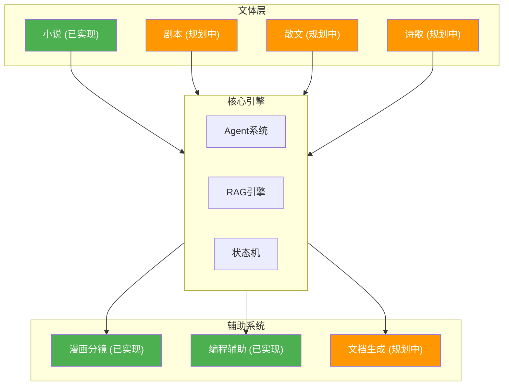
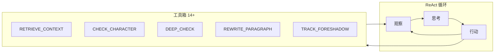
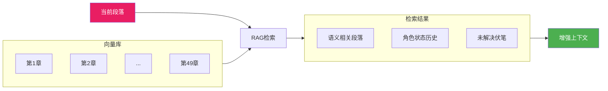
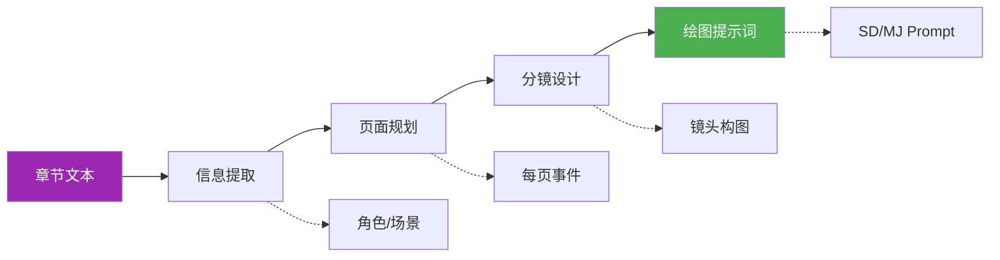
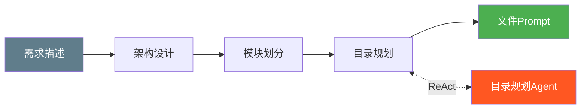
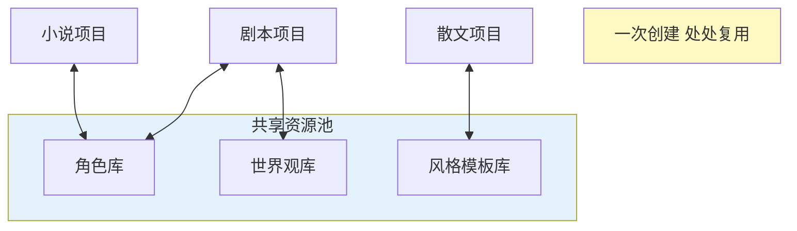
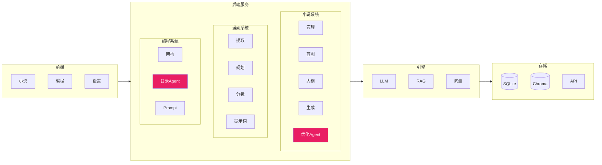
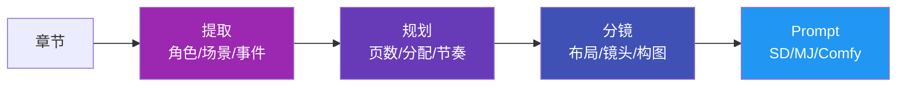
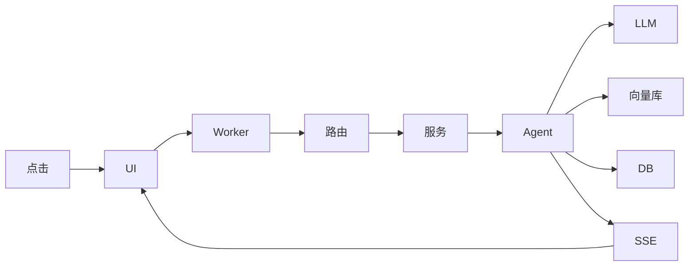
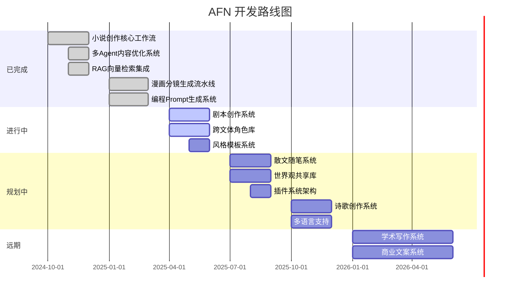

# AFN - Agents for Narrative

> **AI驱动的一站式文字创作平台**
>
> 小说只是起点，我们的目标是解决一切文字问题

---

## 愿景：一站式文字解决方案

**AFN 不只是一个AI小说工具，而是一个文字创作的操作系统。**

我们相信：无论是百万字的长篇小说、一幕话剧、一篇散文、还是一份技术文档——所有文字创作的本质都是**结构化思维的表达**。不同文体只是结构和约束的差异，底层的创作工作流管理是相通的。



## 为什么市场需要 AFN？

当前的AI文字工具存在明显的**碎片化**问题：

| 需求 | 现状 | 问题 |
|------|------|------|
| 写小说 | Novelcrafter、Sudowrite、NovelAI... | 每个工具一套逻辑，数据不互通 |
| 写剧本 | Final Draft AI、Dramatron... | 又是另一套工具和学习成本 |
| 写文档 | Notion AI、Jasper... | 再换一个平台 |
| 写代码注释 | Copilot、Cursor... | 还要再来一个 |

**用户的痛点**：
- 每种文体都要学一个新工具
- 创作资产（角色、世界观、风格）无法跨文体复用
- 订阅费用叠加（$10 + $15 + $20... / 月）
- 数据分散在各个云端，迁移困难

**AFN的答案**：一个平台，解决所有文字问题。

## 当前已实现功能

### 小说创作系统（核心功能）

**状态机驱动的创作工作流**：


- **可回溯**：发现第三卷大纲有问题？回退重新生成，下游自动标记需更新
- **状态持久化**：关闭应用，明天继续，一切状态都在
- **阶段隔离**：每个阶段有明确的输入输出契约

**ReAct Agent 多智能体系统**：



Agent 会根据当前段落的问题，**自主决定**调用哪些工具、以什么顺序调用，而不是机械地执行预设流程。

**RAG 驱动的长期记忆**：



- 向量化存储：所有已完成章节自动入库
- 时序感知检索：不只是语义相似，还考虑时间线
- 角色状态追踪：自动维护每个角色在每章的状态

### 漫画分镜系统

将小说章节转换为漫画分镜，支持后续AI绘图：



- **断点续传**：每个阶段可独立暂停/恢复
- **阶段重跑**：对某阶段不满意可单独重新生成
- **可视化编辑**：每个分镜都可查看和调整

### 编程辅助系统

不只是文学创作，AFN还能辅助技术写作：



- **目录规划Agent**：根据需求自动设计项目结构
- **文件Prompt生成**：为每个代码文件生成详细的实现指南
- **代码审查Prompt**：生成测试和审查清单

## 规划中的功能

### 剧本创作系统（开发中）


**支持格式**：
- 电影剧本（标准好莱坞格式）
- 话剧剧本（舞台剧格式）
- 短视频脚本（分镜+台词+动作）
- 播客/音频剧本

**特色功能**：
- 角色声音一致性检查（确保每个角色说话风格统一）
- 场景节奏分析（控制情绪起伏曲线）
- 对白自然度评估
- 与小说系统共享角色库和世界观

### 散文/随笔系统（规划中）


**支持类型**：叙事散文（游记、回忆录）、议论散文（杂文、评论）、抒情散文（随笔、心情文字）

**特色功能**：风格模仿、意象库管理、节奏感分析

### 更多文体支持（远期规划）

| 文体 | 状态 | 核心功能点 |
|------|------|-----------|
| 诗歌 | 规划中 | 韵律检查、意象推荐、格律约束 |
| 学术论文 | 规划中 | 文献管理、论证结构、引用格式 |
| 商业文案 | 规划中 | A/B测试变体、情感分析、转化率预测 |
| 新闻稿件 | 规划中 | 倒金字塔结构、事实核查、风格规范 |
| 翻译润色 | 规划中 | 多语言支持、本地化建议、术语一致性 |

### 跨文体功能（平台级能力）



**核心理念**：小说里的主角可以直接出演话剧，小说的世界观可以直接用于剧本背景。

## 与现有工具的对比

### 小说创作领域

| 功能 | AFN | Novelcrafter | Sudowrite | AI_NovelGenerator | KoboldAI |
|------|-----|--------------|-----------|-------------------|----------|
| 多阶段工作流 | 6阶段状态机 | 有 | 有限 | 4阶段 | 无 |
| 状态回溯 | 完整支持 | 部分 | 部分 | 无 | 无 |
| ReAct Agent | 多Agent协作 | 无 | 无 | 无 | 无 |
| RAG长期记忆 | 时序感知检索 | Codex手动 | Story Bible | 有 | 有限 |
| 漫画分镜 | 完整流水线 | 无 | 无 | 无 | 无 |
| 本地部署 | 完全本地 | 云端 | 云端 | 本地 | 本地/云端 |
| 开源 | 是 | 否 | 否 | 是 | 是 |
| 多文体扩展 | 平台化设计 | 仅小说 | 仅小说 | 仅小说 | 仅小说 |

### 平台级对比

| 维度 | AFN | 传统方案（多工具组合） |
|------|-----|----------------------|
| 工具数量 | 1个平台 | 小说+剧本+文档=3+个工具 |
| 学习成本 | 一次学习 | 每个工具各学一遍 |
| 数据互通 | 原生支持 | 手动导出导入 |
| 资产复用 | 角色/世界观跨文体 | 重新创建 |
| 月费 | $0（自备API） | $50+（多订阅叠加） |
| 数据所有权 | 完全本地 | 分散在各云端 |

## 技术架构

### 整体架构



### 小说创作流程


### 漫画分镜流程



### 编程辅助流程


### 数据流



### 核心组件

| 组件 | 说明 | 实现 |
|------|------|------|
| LLM服务 | 大模型调用 | OpenAI/DeepSeek/通义/Ollama |
| RAG检索 | 时序向量检索 | ChromaDB + 时序权重 |
| 提示词 | 版本管理 | MD文件 + DB同步 |
| 向量化 | 文本嵌入 | sentence-transformers |
| 任务队列 | 异步处理 | 内存队列 + SSE |
| 图片生成 | AI绘图 | SD/ComfyUI/MJ |

## 快速开始

```bash
# 克隆项目
git clone https://github.com/your-repo/AFN.git
cd AFN

# 一键启动（自动配置环境、安装依赖）
python run_app.py
```

**系统要求**：
- Windows 10/11
- Python 3.10+
- 8GB内存（推荐16GB）
- 需配置LLM API（支持OpenAI、DeepSeek、通义千问、Ollama本地等）

## 适用场景

**AFN 适合你，如果你：**
- 是需要处理多种文体的创作者（小说家、编剧、自媒体...）
- 厌倦了为每种需求订阅不同的工具
- 希望创作资产（角色、世界观、风格）能跨项目复用
- 重视数据隐私，希望一切存储在本地
- 喜欢开源、可定制的解决方案
- 有技术背景，愿意参与平台的扩展开发

**AFN 可能不适合，如果你：**
- 只需要快速生成短篇内容
- 偏好开箱即用的云端服务
- 不想管理本地环境和API配置

## 开发路线图



## 参与贡献

AFN 是一个开放的平台，我们欢迎：

- **文体扩展**：为新的文体类型开发适配器
- **Agent工具**：为Agent系统添加新的工具
- **提示词优化**：改进各环节的提示词质量
- **UI/UX改进**：提升用户体验
- **文档翻译**：帮助项目走向国际

## 许可证

MIT License

---

## 致谢

- [AI_NovelGenerator](https://github.com/YILING0013/AI_NovelGenerator) - 多章节生成的灵感来源
- [KoboldAI](https://github.com/KoboldAI/KoboldAI-Client) - 本地模型支持的先驱
- [Novelcrafter](https://www.novelcrafter.com/) - Codex知识库概念的启发
- [StoryCraftr](https://github.com/raestrada/storycraftr) - CLI工作流的参考

## 参考资料

- [GitHub AI小说项目盘点](https://zhuanlan.zhihu.com/p/1888262970552862495)
- [Novelcrafter 评测](https://kindlepreneur.com/novelcrafter-review/)
- [Sudowrite vs Novelcrafter 对比](https://sudowrite.com/blog/sudowrite-vs-novelcrafter-the-ultimate-ai-showdown-for-novelists/)
- [2025-2026 最佳AI写作工具](https://kindlepreneur.com/best-ai-writing-tools/)
