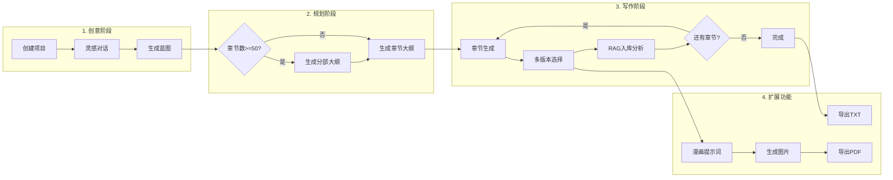
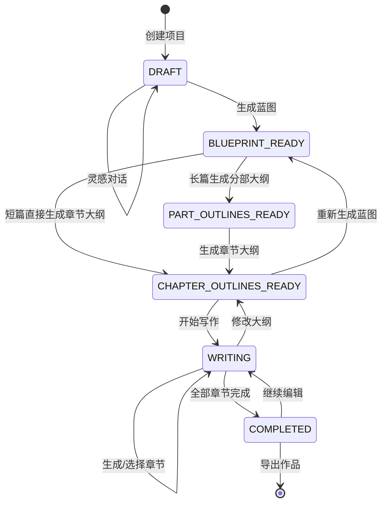
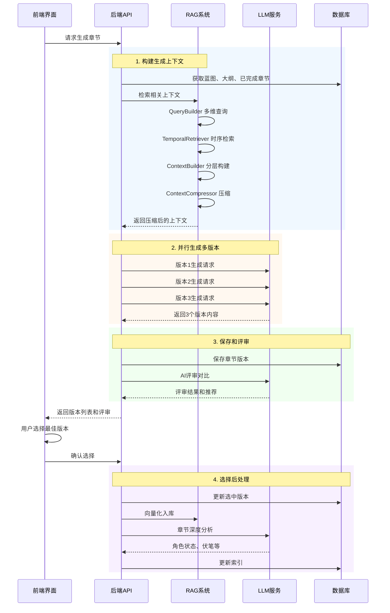
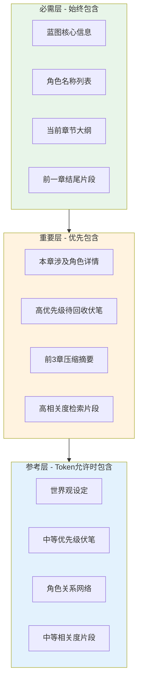
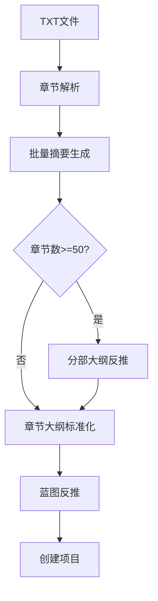
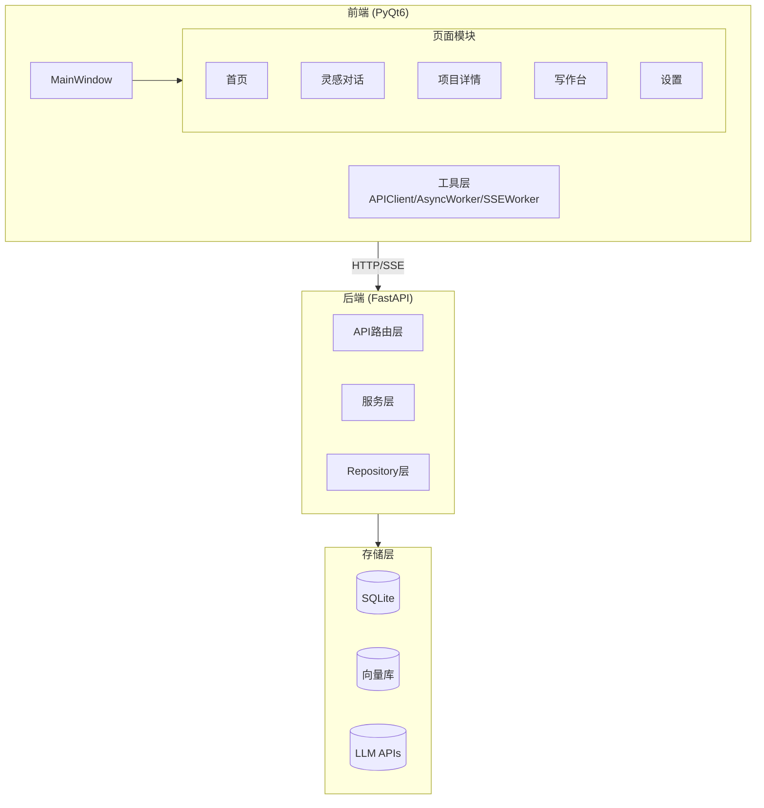

# AFN (Agents for Novel) - AI 辅助长篇小说创作工具

AI 辅助长篇小说创作桌面应用，开箱即用，无需登录，本地存储。

## 目录

- [功能特性](#功能特性)
- [快速开始](#快速开始)
- [核心流程](#核心流程)
  - [小说创作主流程](#小说创作主流程)
  - [项目状态机](#项目状态机)
  - [章节生成流程](#章节生成流程)
- [功能模块详解](#功能模块详解)
- [配置说明](#配置说明)
- [技术架构](#技术架构)
- [常见问题](#常见问题)
- [许可证](#许可证)

---

## 功能特性

### 核心创作功能

| 功能 | 说明 |
|------|------|
| **灵感对话** | 与AI交互，梳理创意，引导式构建完整小说概念 |
| **蓝图生成** | 自动生成世界观、角色设定、剧情大纲 |
| **分层大纲** | 长篇小说支持分部大纲 + 章节大纲双层结构 |
| **智能写作** | 多版本并行生成，AI评审辅助选择最佳版本 |
| **RAG增强** | 智能检索上下文，角色状态追踪，伏笔管理 |
| **正文优化** | Agent逐段分析，检测逻辑/角色/时间线问题 |

### 扩展功能

| 功能 | 说明 |
|------|------|
| **漫画转化** | 章节自动分割场景，生成AI绘图提示词 |
| **图片生成** | 集成多厂商API，一键生成场景插图 |
| **角色立绘** | 基于角色设定生成人物立绘 |
| **PDF导出** | 图片导出为PDF，支持自定义布局 |
| **外部导入** | 导入TXT小说，智能分析生成蓝图和大纲 |

### 用户体验

- **开箱即用**：无需注册登录，启动即可使用
- **界面配置**：所有设置在应用内完成，无需修改配置文件
- **本地存储**：数据完全存储在本地，隐私安全
- **主题切换**：支持深色/亮色主题，可自定义配色
- **灵活配置**：支持多个LLM提供商，随时切换

---

## 快速开始

### 方式一：一键启动（推荐）

```bash
# 首次运行会自动创建虚拟环境并安装依赖
python run_app.py
```

脚本会自动完成：
1. 检查 Python 版本（需要 3.10+）
2. 检测并安装 uv 加速器（比pip快10-100倍）
3. 创建前后端虚拟环境
4. 安装所有依赖
5. 启动后端服务（端口 8123）
6. 启动前端 GUI

### 方式二：分别启动

#### 1. 启动后端

```bash
cd backend
python -m venv .venv
.venv\Scripts\activate
pip install -r requirements.txt
uvicorn app.main:app --reload --port 8123
```

#### 2. 启动前端

```bash
cd frontend
python -m venv .venv
.venv\Scripts\activate
pip install -r requirements.txt
python main.py
```

### 3. 配置 LLM

1. 点击右下角设置按钮进入设置页面
2. 选择 "LLM 配置"
3. 点击 "新建配置"
4. 填写 API Key 等信息
5. 点击 "激活此配置"

完成！开始创作您的第一部小说。

---

## 核心流程

### 小说创作主流程



### 项目状态机

项目在创作过程中会经历以下状态流转：



| 状态 | 说明 | 可执行操作 |
|------|------|------------|
| `DRAFT` | 草稿阶段 | 灵感对话、生成蓝图 |
| `BLUEPRINT_READY` | 蓝图就绪 | 编辑蓝图、生成大纲 |
| `PART_OUTLINES_READY` | 分部大纲就绪 | 编辑分部、生成章节大纲 |
| `CHAPTER_OUTLINES_READY` | 章节大纲就绪 | 编辑大纲、开始写作 |
| `WRITING` | 写作中 | 生成章节、选择版本、漫画转化 |
| `COMPLETED` | 已完成 | 导出、继续编辑 |

### 章节生成流程

展示RAG增强的智能章节生成过程：



### RAG上下文分层

章节生成时，RAG系统按优先级构建上下文：



---

## 功能模块详解

### 灵感对话

与AI进行互动式对话，引导构建完整的小说概念：

- **智能引导**：AI根据对话进展动态调整问题
- **灵感选项**：每轮提供3-5个差异化方向供选择
- **自由输入**：随时可以输入自己的想法
- **信息收集**：自动收集类型、风格、主角、冲突等核心要素
- **章节规划**：确定预期篇幅（5-10000章）

### 蓝图生成

基于灵感对话自动生成完整的小说蓝图：

```
蓝图结构
├── 基本信息（标题、类型、风格、基调）
├── 世界观设定
│   ├── 核心规则
│   ├── 关键地点
│   └── 势力派系
├── 角色设定
│   ├── 角色档案（身份、性格、目标、能力）
│   └── 角色关系网
└── 故事大纲（一句话概括 + 完整大纲）
```

### 大纲管理

支持两层大纲结构，适应不同篇幅需求：

| 篇幅 | 大纲结构 |
|------|----------|
| 短篇（<50章） | 直接生成章节大纲 |
| 长篇（>=50章） | 分部大纲 → 章节大纲 |

**分部大纲**：每部分约25章，包含主题、关键事件、角色成长弧线

**章节大纲**：每章标题 + 100-200字摘要，包含冲突、转折、悬念

### 章节写作

智能化的章节生成和版本管理：

1. **多版本生成**：并行生成3个不同版本
2. **AI评审**：自动对比分析，给出推荐
3. **版本选择**：用户最终决定使用哪个版本
4. **RAG增强**：选中版本自动向量化入库
5. **深度分析**：提取角色状态、伏笔、关键事件

### 正文优化

基于ReAct循环的Agent系统，逐段检查：

- **逻辑连贯性**：因果关系、情节过渡
- **角色一致性**：性格、能力、状态
- **伏笔呼应**：铺垫、回收
- **时间线一致性**：时间流逝、事件顺序
- **风格一致性**：叙事风格、用词习惯
- **场景描写**：环境细节、空间关系

### 漫画转化

将章节内容转化为漫画分镜：


- **场景分割**：自动识别场景切换点
- **分格规划**：根据场景设计漫画分格
- **提示词生成**：生成适配AI绘图的英文提示词
- **多语言支持**：提示词支持中英文

### 外部导入

导入已有TXT小说，智能分析生成完整项目：



---

## 配置说明

### LLM 配置

支持多个LLM提供商：

| 提供商 | 说明 |
|--------|------|
| OpenAI | GPT-3.5, GPT-4, GPT-4o |
| 通义千问 | 阿里云大模型 |
| 智谱 ChatGLM | 国产大模型 |
| 百度文心一言 | 百度大模型 |
| Moonshot (Kimi) | 月之暗面 |
| DeepSeek | 深度求索 |
| Ollama | 本地部署 |
| OpenAI兼容接口 | 2API、API2D等中转服务 |

**配置步骤**：设置 → LLM配置 → 新建配置 → 填写Base URL和API Key → 激活

### 嵌入配置

RAG功能需要嵌入服务：

| 类型 | 说明 |
|------|------|
| OpenAI兼容接口 | 使用远程嵌入API |
| Ollama本地模型 | 使用本地部署的嵌入模型 |

**配置步骤**：设置 → 嵌入配置 → 新建配置 → 选择类型并填写信息 → 激活

### 图片生成配置

| 服务类型 | 说明 |
|----------|------|
| OpenAI兼容接口 | DALL-E 2/3、Gemini、nano-banana-pro等 |
| Stability AI | Stable Diffusion XL等 |
| 本地ComfyUI | 支持自定义工作流 |

**配置步骤**：设置 → 生图模型 → 新增配置 → 选择类型并填写信息 → 激活

### 主题配置

支持深色/亮色主题切换，可自定义配色：

- 点击右下角主题切换按钮
- 悬停查看当前主题配置
- 在设置中可自定义颜色

---

## 技术架构

### 系统架构



### 目录结构

```
AFN/
├── backend/                  # FastAPI 后端服务
│   ├── app/
│   │   ├── api/routers/     # API 路由
│   │   │   ├── novels/      # 项目管理（灵感、蓝图、大纲）
│   │   │   └── writer/      # 写作阶段（章节、漫画、优化）
│   │   ├── services/        # 业务逻辑层
│   │   │   ├── chapter_generation/  # 章节生成
│   │   │   ├── rag/                 # RAG检索系统
│   │   │   ├── manga_prompt/        # 漫画提示词
│   │   │   ├── image_generation/    # 图片生成
│   │   │   ├── import_analysis/     # 导入分析
│   │   │   └── content_optimization/ # 正文优化
│   │   ├── models/          # SQLAlchemy 模型
│   │   ├── schemas/         # Pydantic 数据模型
│   │   └── core/            # 核心模块（依赖注入、状态机）
│   ├── prompts/             # LLM 提示词模板
│   └── storage/             # 数据存储
│       ├── afn.db           # SQLite 数据库
│       └── generated_images/ # 生成的图片
│
├── frontend/                 # PyQt6 桌面前端
│   ├── windows/             # 页面窗口
│   │   ├── inspiration_mode/ # 灵感对话
│   │   ├── novel_detail/    # 项目详情
│   │   ├── writing_desk/    # 写作台
│   │   └── settings/        # 设置页面
│   ├── components/          # UI 组件库
│   ├── themes/              # 主题系统
│   │   └── theme_manager/   # 主题管理器（Mixin架构）
│   ├── api/client/          # API 客户端（Mixin架构）
│   └── utils/               # 工具类
│
├── docs/                    # 项目文档
│   └── ARCHITECTURE.md      # 详细架构图
├── run_app.py               # 统一启动入口
└── build.bat                # 打包脚本
```

### 技术栈

| 层级 | 技术 | 版本 |
|------|------|------|
| 前端框架 | PyQt6 | 6.6.1 |
| 后端框架 | FastAPI | 0.110.0 |
| ORM | SQLAlchemy 2.0 | 异步 |
| 数据库 | SQLite + aiosqlite | - |
| 向量库 | ChromaDB | - |
| PDF生成 | ReportLab | - |
| LLM集成 | OpenAI兼容API | - |

---

## 常见问题

### 启动相关

**Q: 启动失败怎么办？**

1. 检查 Python 版本：`python --version`（需要 3.10+）
2. 查看日志：`storage/app.log` 和 `storage/debug.log`
3. 确保端口 8123 未被占用：`netstat -ano | findstr 8123`

**Q: 端口被占用？**

```bash
# 查找占用进程
netstat -ano -p TCP | findstr 8123
# 结束进程
taskkill /F /PID <pid>
```

### LLM 相关

**Q: 如何获取 API Key？**

- **OpenAI**：https://platform.openai.com/api-keys
- **国内服务**：2API、API2D 等中转服务
- **本地部署**：安装 Ollama 使用本地模型

**Q: 生成速度慢？**

1. 使用更快的模型（如 gpt-3.5-turbo）
2. 使用国内中转服务降低延迟
3. 检查网络连接

### RAG 相关

**Q: RAG功能需要额外配置吗？**

是的，需要配置嵌入服务：
1. 进入设置 → 嵌入配置
2. 新建配置（推荐使用OpenAI兼容接口或Ollama本地模型）
3. 激活配置

### 图片生成相关

**Q: 如何配置图片生成服务？**

1. 进入设置 → 生图模型
2. 点击"新增配置"
3. 选择服务类型（OpenAI兼容/Stability/ComfyUI）
4. 填写API地址和密钥
5. 点击"激活"

推荐使用 nano-banana-pro 或 DALL-E 3 获得最佳效果。

---

## 系统要求

- **操作系统**：Windows 10/11
- **Python**：3.10+
- **内存**：8GB（推荐16GB）
- **网络**：需要网络连接调用 LLM API

---

## 隐私和安全

- 所有数据存储在本地
- 不收集任何用户信息
- API Key 仅存储在本地数据库
- 不上传任何创作内容（除了发送给 LLM）

---

## 许可证

MIT License

---

## 相关文档

- [详细架构图](docs/ARCHITECTURE.md) - 完整的技术架构和数据模型
- [API文档](http://localhost:8123/docs) - 运行后访问

---

**立即开始**：运行 `python run_app.py` 一键启动！
