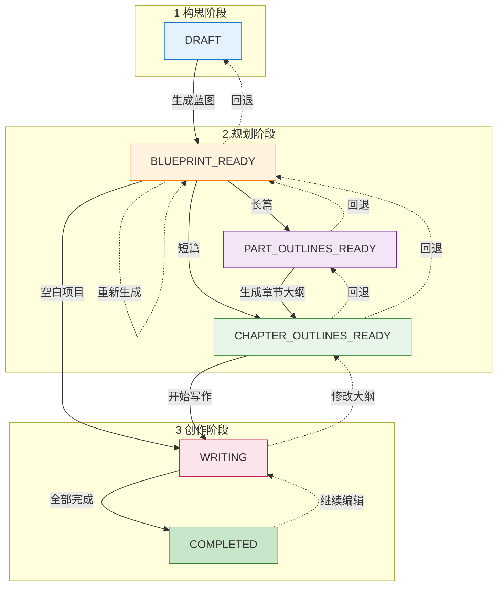
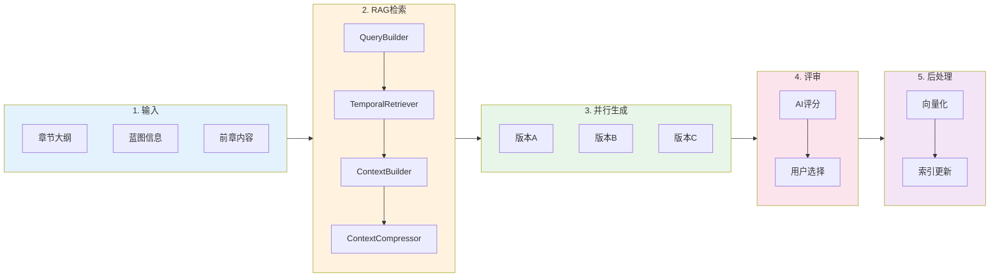
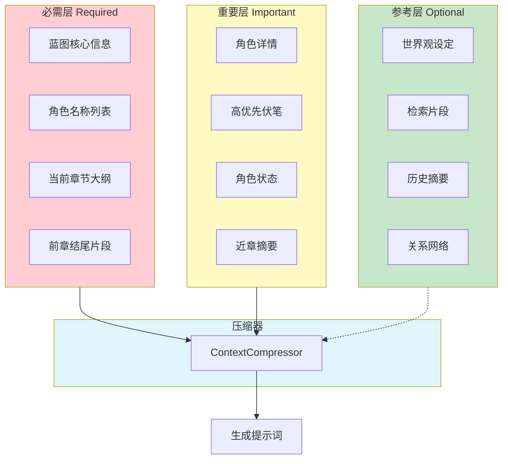
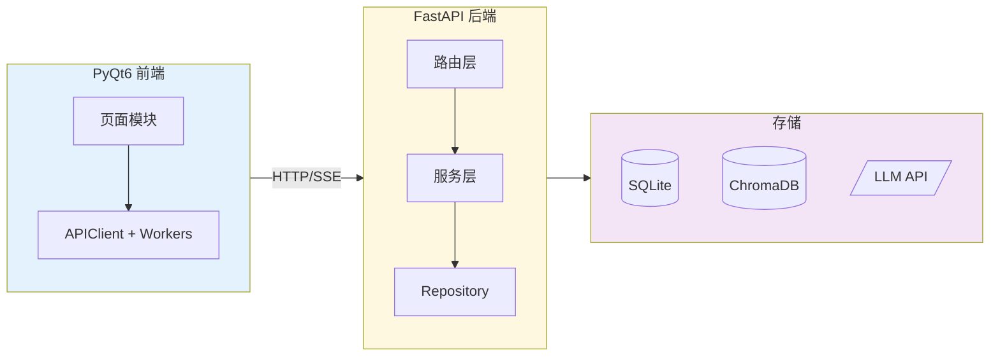
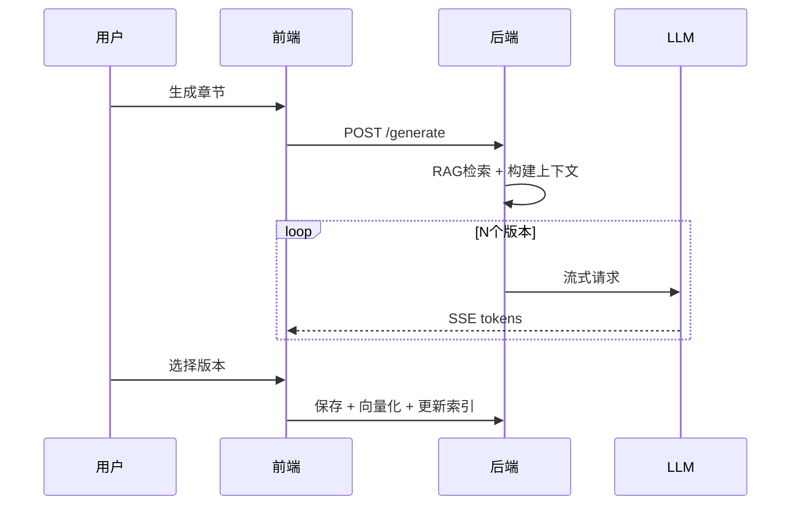

# AFN (Agents for Novel)

> AI 辅助长篇小说创作桌面应用 | 开箱即用 | 无需登录 | 本地存储


---

## 目录

- [功能特性](#功能特性)
- [快速开始](#快速开始)
- [创作流程](#创作流程)
- [项目结构](#项目结构)
- [技术架构](#技术架构)
- [配置指南](#配置指南)
- [常见问题](#常见问题)

---

## 功能特性

### 核心创作流程

| 功能 | 说明 |
|:-----|:-----|
| **灵感对话** | 与 AI 交互式构建小说概念，通过多轮对话逐步明确故事方向 |
| **蓝图生成** | 基于对话内容一键生成完整蓝图：世界观、角色设定、人物关系、故事梗概 |
| **分层大纲** | 长篇(>=50章)支持「分部大纲 + 章节大纲」双层结构，短篇直接生成章节大纲 |
| **多版本生成** | 每章并行生成多个版本，AI 对比评审辅助用户选择最佳版本 |
| **RAG 增强** | 三层上下文（必需/重要/参考）、角色状态追踪、伏笔管理、时序感知检索 |
| **正文优化** | Agent 逐段分析章节内容，检测逻辑漏洞、角色一致性、时间线问题 |

### 扩展能力

| 功能 | 说明 |
|:-----|:-----|
| **漫画分镜生成** | 4步流水线架构：信息提取 → 页面规划 → 分镜设计 → 提示词构建 |
| **图片生成** | 集成 OpenAI DALL-E / Stability AI / ComfyUI 多厂商 |
| **角色立绘** | 基于角色设定生成人物立绘，支持作为分镜参考图 |
| **外部导入** | 导入已有 TXT 小说，智能分析反推蓝图和大纲 |
| **主角档案** | 独立管理主角信息，支持隐式追踪和同步更新 |

### 界面特性

| 功能 | 说明 |
|:-----|:-----|
| **深色/浅色主题** | 一键切换（Ctrl+T），支持自定义主题配置 |
| **透明模式** | Windows DWM Acrylic 毛玻璃效果，支持背景图片和透明度调节 |
| **LRU 页面缓存** | 最多缓存 10 个页面，自动淘汰最久未使用的页面 |
| **高 DPI 支持** | 响应式布局，适配不同分辨率屏幕 |

---

## 快速开始

### 一键启动（推荐）

```bash
python run_app.py
```

首次运行自动完成：
1. 检测 Python 版本（需要 3.10+）
2. 安装 [uv](https://github.com/astral-sh/uv) 包管理器（比 pip 快 10-100 倍）
3. 创建前后端独立虚拟环境
4. 安装依赖（自动检测已安装的核心包）
5. 自动处理端口占用（8123）
6. 启动后端服务和前端 GUI

### 手动启动

```bash
# 后端（端口 8123）
cd backend
.venv\Scripts\activate
uvicorn app.main:app --reload --port 8123

# 前端（新终端）
cd frontend
.venv\Scripts\activate
python main.py
```

### 配置 LLM

1. 启动应用后，点击右下角进入 **设置**
2. 进入 **LLM 配置** → **新建配置**
3. 填写 Base URL（如 `https://api.openai.com/v1`）和 API Key
4. 点击 **测试连接** 验证后 **激活此配置**

完成！开始创作您的第一部小说。

---

## 创作流程

### 项目状态机



**状态说明**：
| 状态 | 阶段 | 说明 | 允许的转换 |
|:-----|:-----|:-----|:-----|
| `DRAFT` | 构思 | 与AI多轮对话，逐步明确故事方向 | → BLUEPRINT_READY |
| `BLUEPRINT_READY` | 规划 | 世界观、角色设定、人物关系、故事梗概 | → PART/CHAPTER_OUTLINES, WRITING, ← DRAFT |
| `PART_OUTLINES_READY` | 规划 | 分部大纲（仅长篇>=50章） | → CHAPTER_OUTLINES, ← BLUEPRINT |
| `CHAPTER_OUTLINES_READY` | 规划 | 章节大纲，每章标题+摘要 | → WRITING, ← PART/BLUEPRINT |
| `WRITING` | 创作 | 多版本并行生成，AI评审，用户选择 | → COMPLETED, ← CHAPTER_OUTLINES |
| `COMPLETED` | 创作 | 全部章节完成，可导出TXT | ← WRITING（继续编辑）|

### 章节生成流程



**流程说明**：
| 阶段 | 组件 | 说明 |
|:-----|:-----|:-----|
| RAG检索 | QueryBuilder | 基于大纲、角色、伏笔构建多维查询 |
| RAG检索 | TemporalRetriever | 时序感知的向量检索，近章权重更高 |
| RAG检索 | ContextBuilder | 分层构建上下文（必需/重要/参考） |
| RAG检索 | ContextCompressor | 压缩至Token限制（约8000） |
| 并行生成 | LLMService | 默认生成3个版本，可配置 |
| 后处理 | ChapterIngestService | 向量化入库 + 角色状态/伏笔索引更新 |

### RAG 上下文分层



**分层策略**：
| 层级 | 优先级 | Token占比 | 内容 |
|:-----|:-----|:-----|:-----|
| 必需层 | 最高 | ~40% | 蓝图核心、角色列表、当前大纲、前章结尾(500-1000字) |
| 重要层 | 高 | ~35% | 本章角色详情、高优先伏笔、角色状态、前3章摘要 |
| 参考层 | 低 | ~25% | 世界观、向量检索片段(相似度>0.7)、历史摘要 |

> Token限制约8000，超限时按优先级从参考层开始裁剪

### 漫画分镜生成流程

```mermaid
flowchart LR
    subgraph IN["输入"]
        I1["章节内容"]
        I2["风格设置"]
        I3["页数范围"]
        I4["角色立绘"]
    end

    subgraph S1["1.信息提取"]
        E1["ChapterInfoExtractor"]
    end

    subgraph S2["2.页面规划"]
        P1["PagePlanner"]
    end

    subgraph S3["3.分镜设计"]
        D1["StoryboardDesigner"]
    end

    subgraph S4["4.提示词"]
        B1["PromptBuilder"]
    end

    subgraph OUT["输出"]
        O1["MangaPromptResult"]
    end

    IN --> S1
    S1 -->|ChapterInfo| S2
    S2 -->|PagePlan| S3
    S3 -->|Storyboard| S4
    S4 --> OUT

    style IN fill:#e3f2fd
    style S1 fill:#fff3e0
    style S2 fill:#e8f5e9
    style S3 fill:#fce4ec
    style S4 fill:#f3e5f5
    style OUT fill:#e0f7fa
```



**4步流水线详解**：
| 步骤 | 组件 | 输入 | 输出 | 说明 |
|:-----|:-----|:-----|:-----|:-----|
| 1 | ChapterInfoExtractor | 章节文本 | ChapterInfo | 提取角色、对话、场景、事件、物品信息 |
| 2 | PagePlanner | ChapterInfo | PagePlanResult | 页数分配、节奏控制(fast/medium/slow)、页面角色 |
| 3 | StoryboardDesigner | PagePlan | StoryboardResult | 画格布局、镜头类型、气泡位置、音效标注 |
| 4 | PromptBuilder | Storyboard | MangaPromptResult | 双语提示词、负面提示词、参考图注入 |

**断点续传**：`pending → extracting → planning → storyboard → completed`，每阶段自动保存

**漫画风格**：
| 风格 | 说明 | 阅读方向 |
|:-----|:-----|:-----|
| `manga` | 日式漫画 | 右到左 |
| `anime` | 动漫截图 | 左到右 |
| `comic` | 美式漫画 | 左到右 |
| `webtoon` | 条漫 | 上到下 |

**画格枚举**：
| 类型 | 可选值 |
|:-----|:-----|
| ShotType | extreme_close_up, close_up, medium, long, birds_eye, worms_eye |
| PanelSize | small, medium, large, full_page, double_page |
| PanelShape | rectangle, square, vertical, horizontal, diagonal, irregular |

---

## 项目结构

```
AFN/
├── run_app.py                 # 统一启动入口
├── build.bat                  # PyInstaller 打包脚本
├── CLAUDE.md                  # Claude Code 开发指南
│
├── backend/                   # FastAPI 异步后端
│   ├── app/
│   │   ├── main.py            # 应用入口
│   │   ├── exceptions.py      # 统一异常体系
│   │   ├── api/routers/
│   │   │   ├── novels/        # 项目管理
│   │   │   └── writer/        # 写作阶段
│   │   ├── services/          # 业务逻辑层
│   │   │   ├── chapter_generation/  # 章节生成
│   │   │   ├── rag/           # RAG 检索增强
│   │   │   ├── manga_prompt/  # 漫画分镜生成
│   │   │   │   ├── extraction/    # 信息提取
│   │   │   │   ├── planning/      # 页面规划
│   │   │   │   ├── storyboard/    # 分镜设计
│   │   │   │   ├── prompt_builder/# 提示词构建
│   │   │   │   └── core/          # 核心服务
│   │   │   └── ...
│   │   ├── models/            # SQLAlchemy ORM
│   │   ├── schemas/           # Pydantic 模型
│   │   ├── repositories/      # 数据访问层
│   │   └── core/              # 状态机/依赖注入
│   ├── prompts/               # LLM 提示词模板
│   └── storage/               # 数据存储
│
├── frontend/                  # PyQt6 桌面前端
│   ├── main.py                # 应用入口
│   ├── api/client/            # API 客户端 (Mixin)
│   ├── windows/               # 页面模块
│   ├── components/            # 通用 UI 组件
│   ├── themes/                # 主题系统
│   └── utils/                 # 工具类
│
└── docs/
    └── ARCHITECTURE.md        # 详细架构图
```

---

## 技术架构

### 技术栈

| 层级 | 技术 | 说明 |
|:-----|:-----|:-----|
| 前端框架 | PyQt6 6.6.1 | 桌面 GUI，Fusion 样式 |
| 后端框架 | FastAPI 0.110.0 | 全异步 API，SSE 流式响应 |
| ORM | SQLAlchemy 2.0 | 异步操作，aiosqlite 驱动 |
| 数据库 | SQLite | 本地存储，无需额外服务 |
| 向量库 | ChromaDB | RAG 检索 |
| LLM | OpenAI 兼容 API | 多厂商支持 |

### 分层架构



### 数据流



---

## 配置指南

### LLM 配置

支持 OpenAI 兼容 API：

| 提供商 | Base URL |
|:-------|:---------|
| OpenAI | `https://api.openai.com/v1` |
| DeepSeek | `https://api.deepseek.com/v1` |
| 通义千问 | `https://dashscope.aliyuncs.com/compatible-mode/v1` |
| Moonshot | `https://api.moonshot.cn/v1` |
| Ollama | `http://localhost:11434/v1` |
| 中转服务 | 2API / API2D / OpenRouter 等 |

### 嵌入配置（RAG 功能）

| 类型 | 说明 |
|:-----|:-----|
| OpenAI 兼容接口 | 远程嵌入 API |
| Ollama 本地模型 | 本地部署嵌入模型 |

### 图片生成配置

| 服务类型 | 说明 |
|:---------|:-----|
| OpenAI 兼容接口 | DALL-E 3 / Gemini 等 |
| Stability AI | Stable Diffusion XL |
| 本地 ComfyUI | 自定义工作流 |

---

## 常见问题

### 启动问题

**Q: 启动失败？**
1. 检查 Python 版本：`python --version`（需要 3.10+）
2. 查看日志：
   - `storage\app.log` - 启动入口日志
   - `storage\debug.log` - 后端详细日志
3. 端口占用：`netstat -ano -p TCP | findstr 8123`

**Q: 端口 8123 被占用？**
- `run_app.py` 会自动尝试关闭占用进程
- 手动处理：`taskkill /F /PID <pid>`

**Q: 依赖安装失败？**
- 删除 `backend\.venv` 和 `frontend\.venv` 目录
- 重新运行 `python run_app.py`

### 功能问题

**Q: LLM 调用失败？**
- 设置页点击 **测试连接** 验证配置
- 检查 API Key 是否正确
- 确认 Base URL 格式（以 `/v1` 结尾）

**Q: RAG/向量检索不工作？**
- 需要先配置嵌入服务（设置 → 嵌入配置）

**Q: 透明效果不生效？**
- 仅 Windows 10/11 支持
- 设置 → 主题设置 → 启用透明模式

---

## 系统要求

| 项目 | 要求 |
|:-----|:-----|
| 操作系统 | Windows 10/11 |
| Python | 3.10+ |
| 内存 | 8GB（推荐 16GB）|
| 网络 | 需要连接 LLM API |

---

## 相关链接

- [API 文档](http://localhost:8123/docs) - 后端启动后访问 Swagger UI
- [详细架构图](docs/ARCHITECTURE.md) - 完整技术架构和数据模型
- [开发指南](CLAUDE.md) - Claude Code 开发规范

---

## 许可证

[MIT License](LICENSE)
