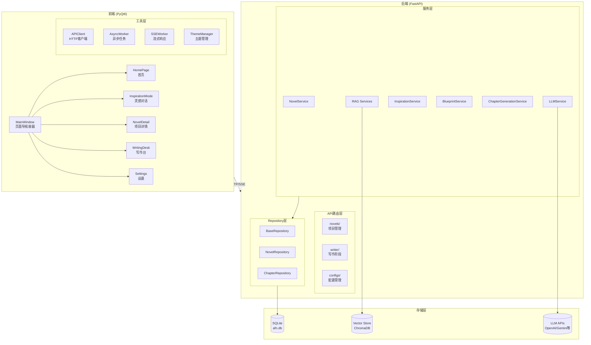
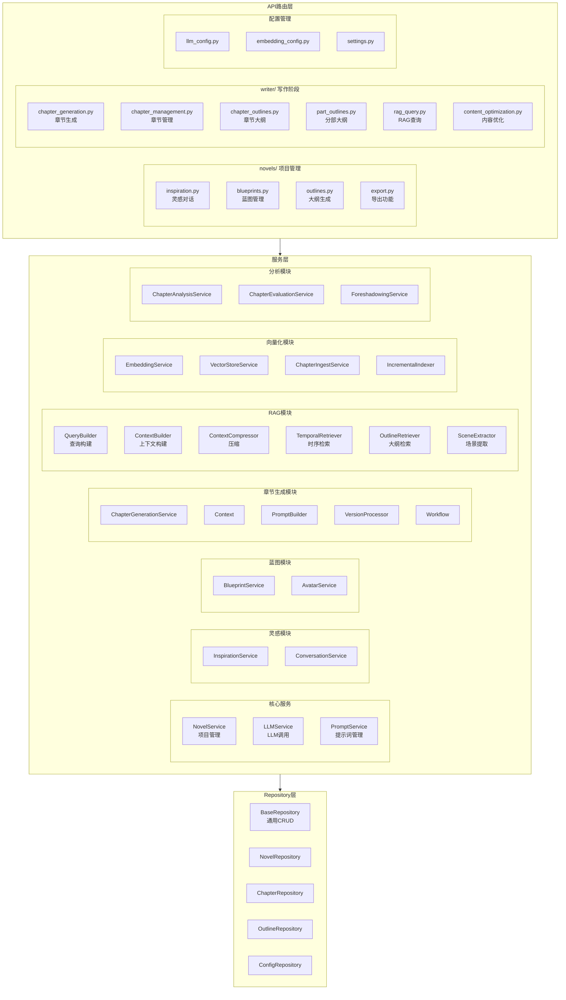
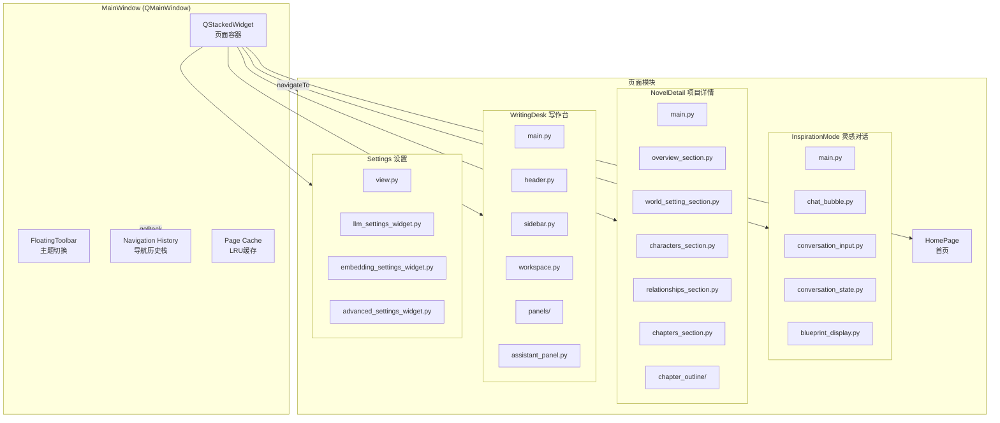
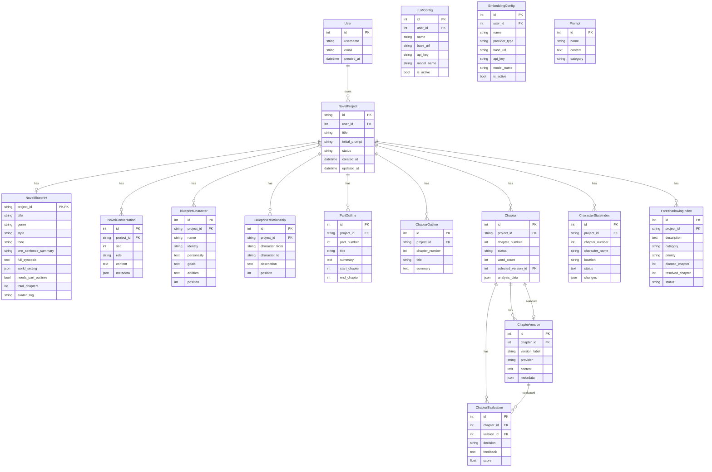
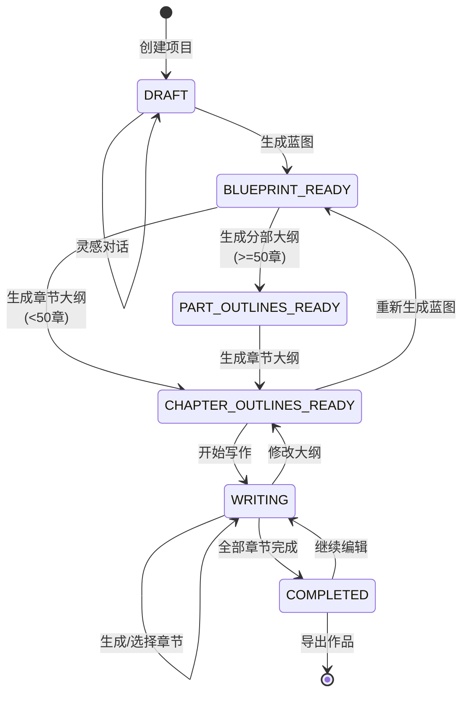
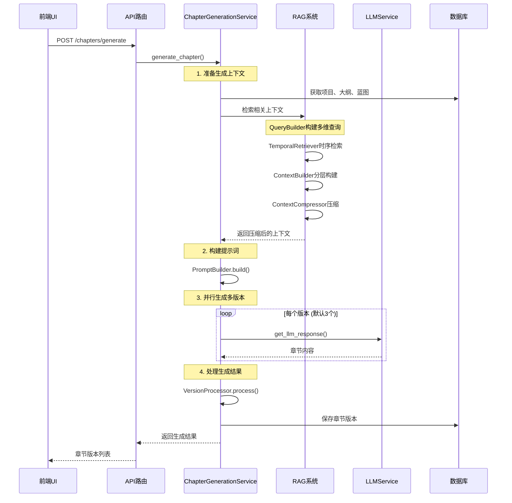
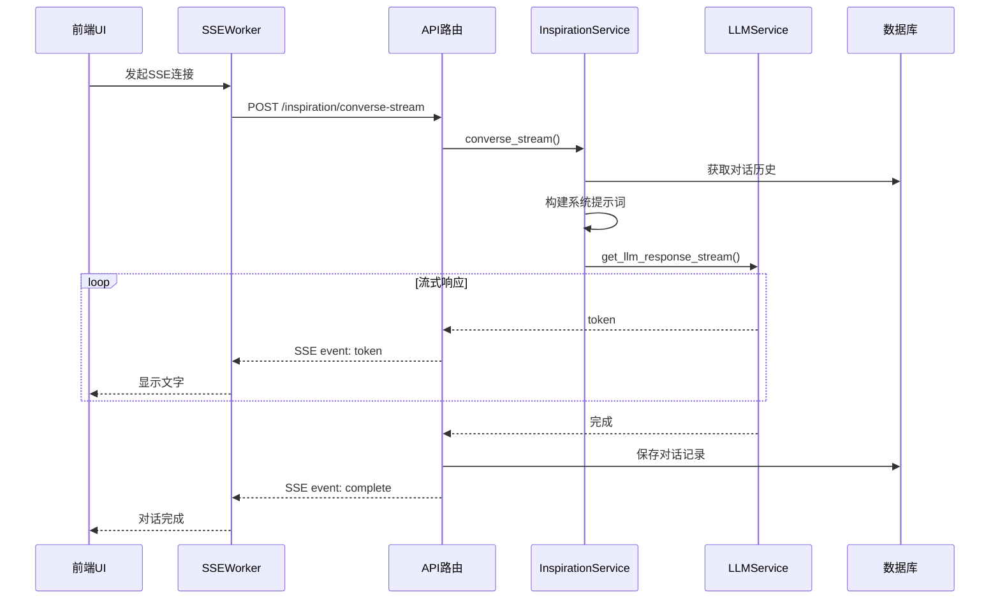
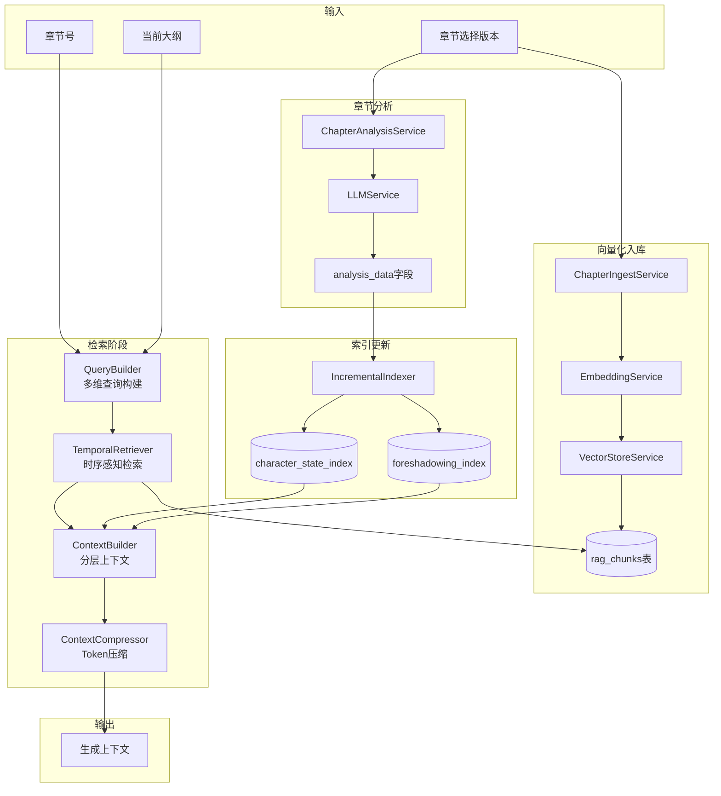
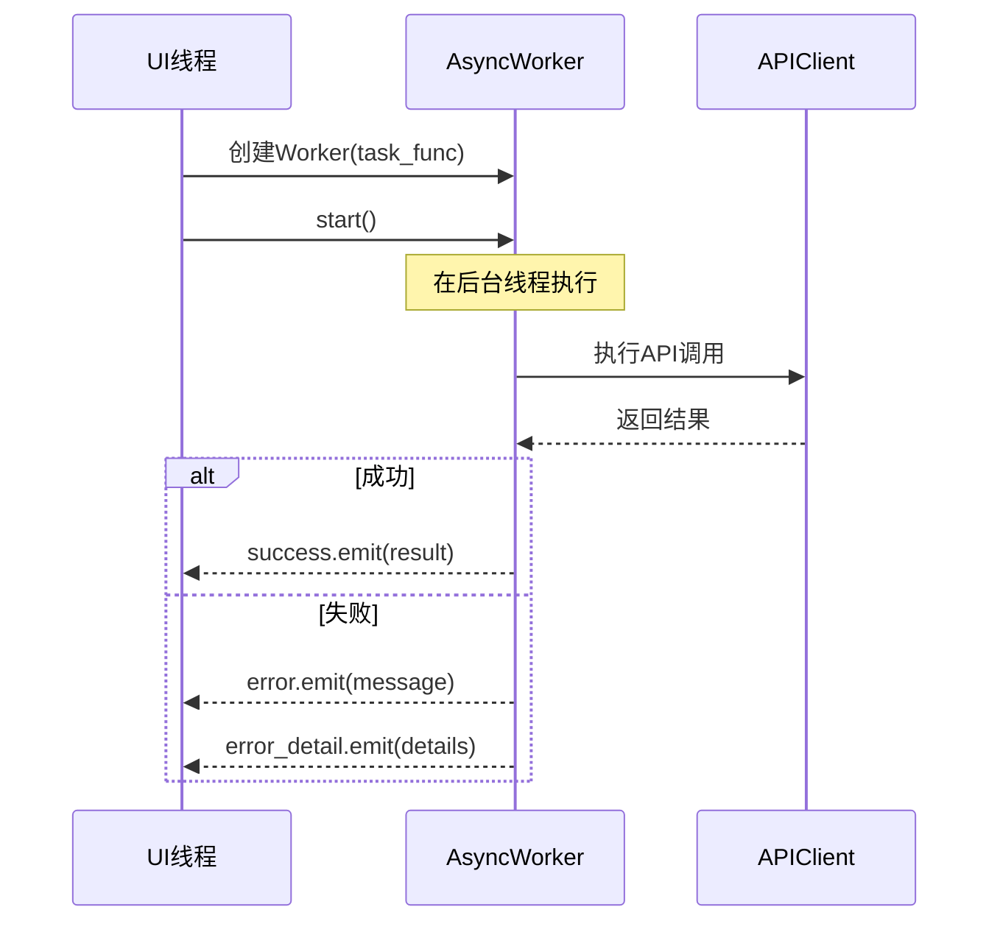
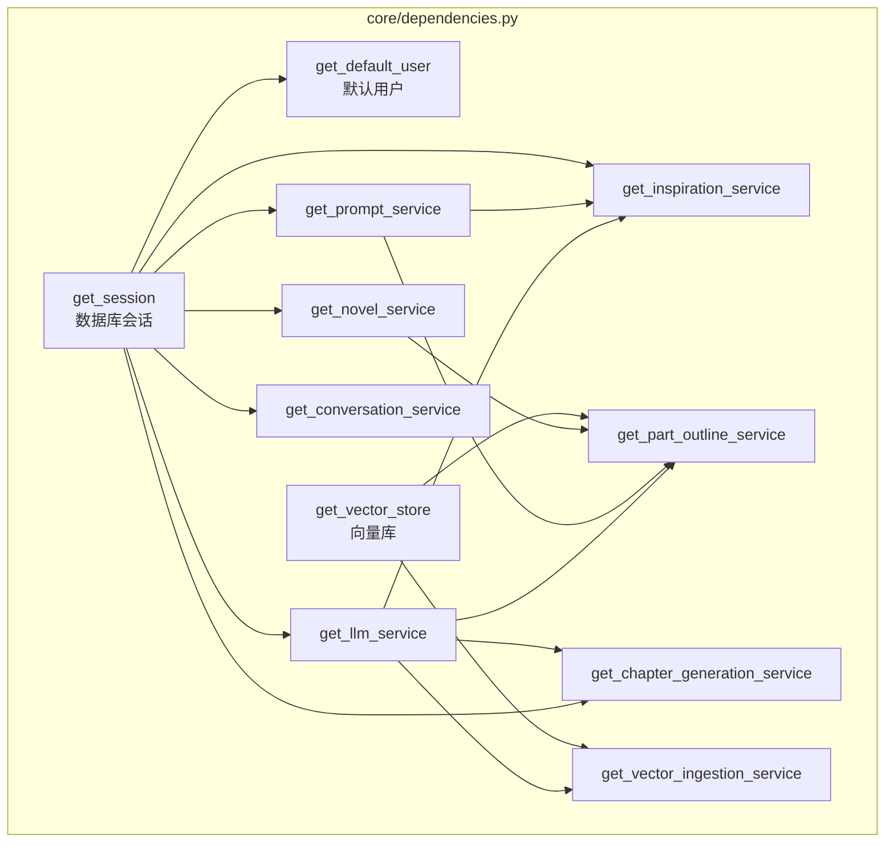

# AFN 技术架构图

本文档描述 AFN (Agents for Novel) 项目的完整技术架构。

## 目录

- [系统总览](#系统总览)
- [整体架构图](#整体架构图)
- [后端架构](#后端架构)
- [前端架构](#前端架构)
- [数据模型](#数据模型)
- [核心业务流程](#核心业务流程)
- [RAG系统架构](#rag系统架构)
- [通信机制](#通信机制)

---

## 系统总览

```
┌─────────────────────────────────────────────────────────────────────────────┐
│                            AFN 系统架构总览                                   │
├─────────────────────────────────────────────────────────────────────────────┤
│                                                                             │
│  ┌─────────────────────────────────────────────────────────────────────┐   │
│  │                        PyQt6 桌面前端                                 │   │
│  │  ┌──────────┐ ┌──────────┐ ┌──────────┐ ┌──────────┐ ┌──────────┐   │   │
│  │  │  首页    │ │灵感对话  │ │项目详情  │ │ 写作台   │ │  设置    │   │   │
│  │  └──────────┘ └──────────┘ └──────────┘ └──────────┘ └──────────┘   │   │
│  │                              ↓                                       │   │
│  │  ┌─────────────────────────────────────────────────────────────┐    │   │
│  │  │     API Client (HTTP/SSE)  +  AsyncWorker  +  SSEWorker     │    │   │
│  │  └─────────────────────────────────────────────────────────────┘    │   │
│  └─────────────────────────────────────────────────────────────────────┘   │
│                                    │                                        │
│                          HTTP REST API (Port 8123)                          │
│                                    │                                        │
│  ┌─────────────────────────────────────────────────────────────────────┐   │
│  │                        FastAPI 后端服务                               │   │
│  │  ┌─────────────────────────────────────────────────────────────┐    │   │
│  │  │                      API 路由层                               │    │   │
│  │  │   novels/  │  writer/  │  llm_config  │  embedding_config    │    │   │
│  │  └─────────────────────────────────────────────────────────────┘    │   │
│  │                              ↓                                       │   │
│  │  ┌─────────────────────────────────────────────────────────────┐    │   │
│  │  │                      服务层 (Services)                        │    │   │
│  │  │  NovelService │ LLMService │ RAGServices │ ChapterGeneration │    │   │
│  │  └─────────────────────────────────────────────────────────────┘    │   │
│  │                              ↓                                       │   │
│  │  ┌─────────────────────────────────────────────────────────────┐    │   │
│  │  │                   Repository层 (数据访问)                     │    │   │
│  │  └─────────────────────────────────────────────────────────────┘    │   │
│  └─────────────────────────────────────────────────────────────────────┘   │
│                                    │                                        │
│         ┌──────────────────────────┼──────────────────────────┐            │
│         ↓                          ↓                          ↓            │
│  ┌─────────────┐          ┌─────────────┐          ┌─────────────┐         │
│  │   SQLite    │          │ Vector Store│          │  LLM APIs   │         │
│  │  (afn.db)   │          │  (ChromaDB) │          │(OpenAI等)   │         │
│  └─────────────┘          └─────────────┘          └─────────────┘         │
│                                                                             │
└─────────────────────────────────────────────────────────────────────────────┘
```

---

## 整体架构图



---

## 后端架构

### 分层架构图



### 服务层详细结构

```
backend/app/services/
├── 核心服务
│   ├── novel_service.py          # 项目CRUD、状态管理
│   ├── llm_service.py            # LLM调用（流式/非流式）
│   └── prompt_service.py         # 提示词加载和缓存
│
├── 灵感对话
│   ├── inspiration_service.py    # 灵感对话业务逻辑
│   └── conversation_service.py   # 对话历史管理
│
├── 蓝图生成
│   ├── blueprint_service.py      # 蓝图生成和优化
│   └── avatar_service.py         # SVG头像生成
│
├── 大纲生成
│   ├── part_outline_service.py   # 分部大纲服务
│   └── part_outline/             # 分部大纲子模块
│       ├── service.py
│       └── workflow.py
│
├── 章节生成 (chapter_generation/)
│   ├── service.py                # 生成服务入口
│   ├── workflow.py               # 完整生成工作流
│   ├── context.py                # 上下文数据结构
│   ├── prompt_builder.py         # 提示词构建
│   └── version_processor.py      # 版本结果处理
│
├── RAG系统 (rag/)
│   ├── query_builder.py          # 多维查询构建
│   ├── context_builder.py        # 分层上下文构建
│   ├── context_compressor.py     # Token限制下的压缩
│   ├── temporal_retriever.py     # 时序感知向量检索
│   ├── outline_retriever.py      # 大纲阶段RAG
│   ├── scene_extractor.py        # 场景状态提取
│   └── utils.py                  # 公共工具
│
├── 向量化和索引
│   ├── embedding_service.py      # 嵌入向量生成
│   ├── vector_store_service.py   # 向量库操作
│   ├── chapter_ingest_service.py # 章节向量化入库
│   └── incremental_indexer.py    # 增量索引更新
│
├── 分析服务
│   ├── chapter_analysis_service.py   # 章节内容分析
│   ├── chapter_evaluation_service.py # 版本评审
│   ├── chapter_context_service.py    # 章节上下文
│   ├── chapter_version_service.py    # 版本管理
│   └── foreshadowing_service.py      # 伏笔追踪
│
└── 配置服务
    ├── llm_config_service.py         # LLM配置CRUD
    └── embedding_config_service.py   # 嵌入配置CRUD
```

---

## 前端架构

### 页面导航系统



### 前端目录结构

```
frontend/
├── main.py                       # 应用入口
├── api/
│   ├── client.py                 # AFNAPIClient HTTP封装
│   ├── manager.py                # API客户端单例管理
│   └── exceptions.py             # API异常定义
│
├── windows/
│   ├── main_window.py            # 主窗口（页面导航容器）
│   │
│   ├── inspiration_mode/         # 灵感对话模块
│   │   ├── main.py              # 主页面
│   │   ├── chat_bubble.py       # 聊天气泡组件
│   │   ├── conversation_input.py # 输入框组件
│   │   ├── conversation_state.py # 对话状态管理
│   │   ├── blueprint_display.py  # 蓝图展示
│   │   ├── blueprint_confirmation.py # 蓝图确认对话框
│   │   └── inspired_option_card.py # 灵感选项卡片
│   │
│   ├── novel_detail/             # 项目详情模块
│   │   ├── main.py              # 主页面
│   │   ├── overview_section.py  # 概览区域
│   │   ├── world_setting_section.py # 世界观设置
│   │   ├── characters_section.py # 角色管理
│   │   ├── relationships_section.py # 角色关系
│   │   ├── chapters_section.py  # 章节列表
│   │   └── chapter_outline/     # 章节大纲子模块
│   │       ├── main.py
│   │       ├── chapter_card.py
│   │       ├── part_outline_card.py
│   │       └── ...
│   │
│   ├── writing_desk/             # 写作台模块
│   │   ├── main.py              # 主页面
│   │   ├── header.py            # 顶部栏
│   │   ├── sidebar.py           # 章节侧边栏
│   │   ├── workspace.py         # 工作区
│   │   ├── chapter_card.py      # 章节卡片
│   │   ├── assistant_panel.py   # AI助手面板
│   │   ├── panels/              # 功能面板
│   │   │   ├── version_panel.py # 版本选择
│   │   │   ├── review_panel.py  # 评审面板
│   │   │   ├── analysis_panel.py # 分析面板
│   │   │   ├── content_panel.py # 内容编辑
│   │   │   └── summary_panel.py # 摘要面板
│   │   └── components/          # 写作台专用组件
│   │
│   └── settings/                 # 设置模块
│       ├── view.py              # 设置主视图
│       ├── llm_settings_widget.py # LLM配置
│       ├── embedding_settings_widget.py # 嵌入配置
│       └── advanced_settings_widget.py # 高级设置
│
├── pages/
│   └── home_page.py              # 首页
│
├── components/                   # 通用组件库
│   ├── base/
│   │   └── theme_aware_widget.py # 主题感知基类
│   └── ...
│
├── themes/                       # 主题系统
│   ├── theme_manager.py          # 主题管理器
│   ├── modern_effects.py         # 现代效果
│   └── svg_icons.py              # SVG图标
│
└── utils/                        # 工具类
    ├── async_worker.py           # 异步任务Worker
    ├── sse_worker.py             # SSE流式响应Worker
    ├── dpi_utils.py              # DPI感知工具
    ├── page_registry.py          # 页面注册表
    └── error_handler.py          # 错误处理
```

---

## 数据模型

### 实体关系图



### 模型层级关系

```
NovelProject (项目主表)
├── NovelBlueprint (蓝图) [1:1]
├── NovelConversation (对话记录) [1:N]
├── BlueprintCharacter (角色) [1:N]
├── BlueprintRelationship (关系) [1:N]
├── PartOutline (分部大纲) [1:N]
├── ChapterOutline (章节大纲) [1:N]
├── Chapter (章节) [1:N]
│   ├── ChapterVersion (版本) [1:N]
│   │   └── ChapterEvaluation (评审) [1:N]
│   └── selected_version -> ChapterVersion [N:1]
├── CharacterStateIndex (角色状态索引) [1:N]
└── ForeshadowingIndex (伏笔索引) [1:N]

配置相关
├── LLMConfig (LLM配置)
├── EmbeddingConfig (嵌入配置)
├── User (用户)
└── Prompt (提示词模板)
```

---

## 核心业务流程

### 创作状态机



### 章节生成流程



### 灵感对话流程



---

## RAG系统架构

### RAG数据流



### RAG上下文分层

```
┌─────────────────────────────────────────────────────────────────┐
│                      RAG上下文分层结构                           │
├─────────────────────────────────────────────────────────────────┤
│                                                                 │
│  ┌─────────────────────────────────────────────────────────┐   │
│  │ 必需层 (Required) - 始终包含                             │   │
│  │  • 蓝图核心信息（标题、类型、风格、基调）                    │   │
│  │  • 角色名称列表                                          │   │
│  │  • 当前章节大纲                                          │   │
│  │  • 前一章结尾片段 (500-1000字)                           │   │
│  └─────────────────────────────────────────────────────────┘   │
│                              ↓                                  │
│  ┌─────────────────────────────────────────────────────────┐   │
│  │ 重要层 (Important) - 优先包含                            │   │
│  │  • 本章涉及角色的详细信息                                  │   │
│  │  • 高优先级待回收伏笔                                     │   │
│  │  • 前3章压缩摘要                                         │   │
│  │  • RAG检索的高相关度片段                                  │   │
│  └─────────────────────────────────────────────────────────┘   │
│                              ↓                                  │
│  ┌─────────────────────────────────────────────────────────┐   │
│  │ 参考层 (Reference) - Token允许时包含                     │   │
│  │  • 世界观设定                                            │   │
│  │  • 中等优先级伏笔                                        │   │
│  │  • RAG检索的中等相关度片段                                │   │
│  │  • 角色关系网络                                          │   │
│  └─────────────────────────────────────────────────────────┘   │
│                                                                 │
│  Token限制: 根据模型上下文窗口动态调整 (默认约8000 tokens)       │
│                                                                 │
└─────────────────────────────────────────────────────────────────┘
```

### RAG组件职责

| 组件 | 职责 | 输入 | 输出 |
|------|------|------|------|
| `QueryBuilder` | 构建多维检索查询 | 大纲、角色、伏笔 | 查询向量列表 |
| `TemporalRetriever` | 时序感知的向量检索 | 查询向量、章节号 | 带权重的片段列表 |
| `ContextBuilder` | 分层构建上下文 | 蓝图、检索结果、分析数据 | 结构化上下文 |
| `ContextCompressor` | 压缩至Token限制 | 完整上下文、Token限制 | 压缩后的上下文 |
| `OutlineRetriever` | 大纲阶段的RAG | 已有大纲、蓝图 | 相关大纲片段 |
| `SceneExtractor` | 提取场景状态 | 章节内容 | 场景状态数据 |

---

## 通信机制

### HTTP REST API

```
前端 (AFNAPIClient)  ────────────────>  后端 (FastAPI)
                     HTTP Request

        • GET/POST/PUT/DELETE
        • JSON请求/响应
        • 超时配置 (10-600秒)
        • 自动重试 (502/503/504)
        • 异常类型映射
```

### SSE (Server-Sent Events)

```
前端 (SSEWorker)  <────────────────  后端 (StreamingResponse)
                   SSE Events

事件类型:
├── token     : {"token": "字符"}        # 流式文本
├── thinking  : {"content": "..."}       # 思考过程
├── complete  : {"is_complete": true}    # 完成信号
└── error     : {"message": "..."}       # 错误信息
```

### 前端异步处理



---

## 依赖注入

### FastAPI依赖图



---

## 技术栈总结

| 层级 | 技术 | 版本 |
|------|------|------|
| **前端框架** | PyQt6 | 6.6.1 |
| **后端框架** | FastAPI | 0.110.0 |
| **ORM** | SQLAlchemy | 2.0 (异步) |
| **数据库驱动** | aiosqlite | - |
| **数据库** | SQLite | - |
| **向量库** | ChromaDB | - |
| **HTTP客户端** | requests | - |
| **异步运行时** | asyncio | - |
| **LLM集成** | OpenAI兼容API | - |

---

## 文件索引

### 后端关键文件

| 文件 | 说明 |
|------|------|
| `backend/app/main.py` | FastAPI应用入口 |
| `backend/app/core/dependencies.py` | 依赖注入 |
| `backend/app/core/state_machine.py` | 项目状态机 |
| `backend/app/exceptions.py` | 统一异常体系 |
| `backend/app/models/novel.py` | 核心数据模型 |
| `backend/app/services/llm_service.py` | LLM调用封装 |
| `backend/app/services/chapter_generation/service.py` | 章节生成服务 |
| `backend/app/services/rag/context_builder.py` | RAG上下文构建 |

### 前端关键文件

| 文件 | 说明 |
|------|------|
| `frontend/main.py` | PyQt6应用入口 |
| `frontend/windows/main_window.py` | 主窗口导航 |
| `frontend/api/client.py` | API客户端 |
| `frontend/utils/async_worker.py` | 异步任务处理 |
| `frontend/utils/sse_worker.py` | SSE流式响应 |
| `frontend/themes/theme_manager.py` | 主题管理 |

---

*文档生成时间: 2024年*
*项目版本: 1.0.0-pyqt*
