# AFN 技术架构图

本文档描述 AFN (Agents for Novel) 项目的完整技术架构。

## 目录

- [系统总览](#系统总览)
- [整体架构图](#整体架构图)
- [后端架构](#后端架构)
- [前端架构](#前端架构)
- [数据模型](#数据模型)
- [核心业务流程](#核心业务流程)
- [漫画分镜生成系统](#漫画分镜生成系统)
- [RAG系统架构](#rag系统架构)
- [通信机制](#通信机制)

---

## 系统总览

```
┌─────────────────────────────────────────────────────────────────────────────┐
│                            AFN 系统架构总览                                   │
├─────────────────────────────────────────────────────────────────────────────┤
│                                                                             │
│  ┌─────────────────────────────────────────────────────────────────────┐   │
│  │                        PyQt6 桌面前端                                 │   │
│  │  ┌──────────┐ ┌──────────┐ ┌──────────┐ ┌──────────┐ ┌──────────┐   │   │
│  │  │  首页    │ │灵感对话  │ │项目详情  │ │ 写作台   │ │  设置    │   │   │
│  │  └──────────┘ └──────────┘ └──────────┘ └──────────┘ └──────────┘   │   │
│  │                              ↓                                       │   │
│  │  ┌─────────────────────────────────────────────────────────────┐    │   │
│  │  │     API Client (HTTP/SSE)  +  AsyncWorker  +  SSEWorker     │    │   │
│  │  └─────────────────────────────────────────────────────────────┘    │   │
│  └─────────────────────────────────────────────────────────────────────┘   │
│                                    │                                        │
│                          HTTP REST API (Port 8123)                          │
│                                    │                                        │
│  ┌─────────────────────────────────────────────────────────────────────┐   │
│  │                        FastAPI 后端服务                               │   │
│  │  ┌─────────────────────────────────────────────────────────────┐    │   │
│  │  │                      API 路由层                               │    │   │
│  │  │   novels/  │  writer/  │  llm_config  │  embedding_config    │    │   │
│  │  └─────────────────────────────────────────────────────────────┘    │   │
│  │                              ↓                                       │   │
│  │  ┌─────────────────────────────────────────────────────────────┐    │   │
│  │  │                      服务层 (Services)                        │    │   │
│  │  │  NovelService │ LLMService │ RAGServices │ ChapterGeneration │    │   │
│  │  └─────────────────────────────────────────────────────────────┘    │   │
│  │                              ↓                                       │   │
│  │  ┌─────────────────────────────────────────────────────────────┐    │   │
│  │  │                   Repository层 (数据访问)                     │    │   │
│  │  └─────────────────────────────────────────────────────────────┘    │   │
│  └─────────────────────────────────────────────────────────────────────┘   │
│                                    │                                        │
│         ┌──────────────────────────┼──────────────────────────┐            │
│         ↓                          ↓                          ↓            │
│  ┌─────────────┐          ┌─────────────┐          ┌─────────────┐         │
│  │   SQLite    │          │ Vector Store│          │  LLM APIs   │         │
│  │  (afn.db)   │          │  (ChromaDB) │          │(OpenAI等)   │         │
│  └─────────────┘          └─────────────┘          └─────────────┘         │
│                                                                             │
└─────────────────────────────────────────────────────────────────────────────┘
```

---

## 整体架构图

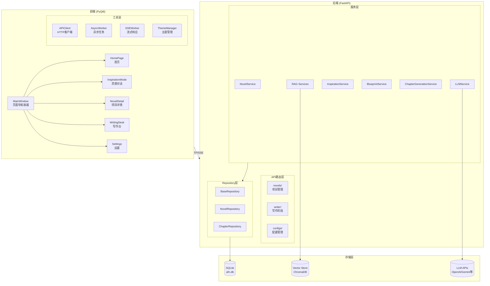

---

## 后端架构

### 分层架构图

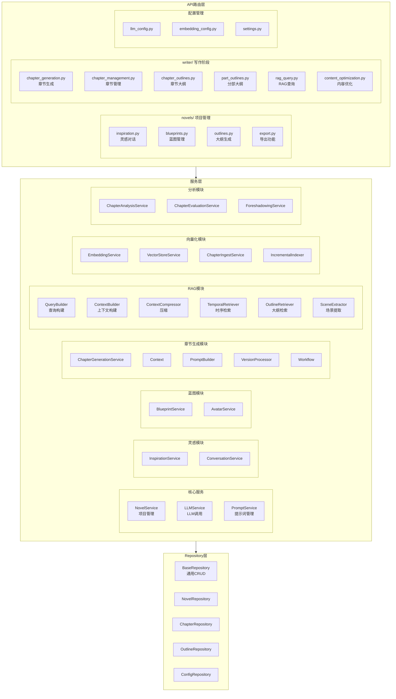

### 服务层详细结构

```
backend/app/services/
├── 核心服务
│   ├── novel_service.py          # 项目CRUD、状态管理
│   ├── llm_service.py            # LLM调用（流式/非流式）
│   └── prompt_service.py         # 提示词加载和缓存
│
├── 灵感对话
│   ├── inspiration_service.py    # 灵感对话业务逻辑
│   └── conversation_service.py   # 对话历史管理
│
├── 蓝图生成
│   ├── blueprint_service.py      # 蓝图生成和优化
│   └── avatar_service.py         # SVG头像生成
│
├── 大纲生成
│   ├── part_outline_service.py   # 分部大纲服务
│   └── part_outline/             # 分部大纲子模块
│       ├── service.py
│       └── workflow.py
│
├── 章节生成 (chapter_generation/)
│   ├── service.py                # 生成服务入口
│   ├── workflow.py               # 完整生成工作流
│   ├── context.py                # 上下文数据结构
│   ├── prompt_builder.py         # 提示词构建
│   └── version_processor.py      # 版本结果处理
│
├── RAG系统 (rag/)
│   ├── query_builder.py          # 多维查询构建
│   ├── context_builder.py        # 分层上下文构建
│   ├── context_compressor.py     # Token限制下的压缩
│   ├── temporal_retriever.py     # 时序感知向量检索
│   ├── outline_retriever.py      # 大纲阶段RAG
│   ├── scene_extractor.py        # 场景状态提取
│   └── utils.py                  # 公共工具
│
├── 向量化和索引
│   ├── embedding_service.py      # 嵌入向量生成
│   ├── vector_store_service.py   # 向量库操作
│   ├── chapter_ingest_service.py # 章节向量化入库
│   └── incremental_indexer.py    # 增量索引更新
│
├── 分析服务
│   ├── chapter_analysis_service.py   # 章节内容分析
│   ├── chapter_evaluation_service.py # 版本评审
│   ├── chapter_context_service.py    # 章节上下文
│   ├── chapter_version_service.py    # 版本管理
│   └── foreshadowing_service.py      # 伏笔追踪
│
├── 漫画分镜服务 (manga_prompt/)
│   ├── extraction/                   # 信息提取
│   │   ├── models.py                # 数据模型
│   │   ├── prompts.py               # 提示词
│   │   └── chapter_info_extractor.py
│   ├── planning/                     # 页面规划
│   │   ├── models.py
│   │   ├── prompts.py
│   │   └── page_planner.py
│   ├── storyboard/                   # 分镜设计
│   │   ├── models.py
│   │   ├── prompts.py
│   │   └── designer.py
│   ├── prompt_builder/               # 提示词构建
│   │   ├── models.py
│   │   └── builder.py
│   └── core/                         # 核心服务
│       ├── service.py               # MangaPromptServiceV2
│       ├── checkpoint_manager.py    # 断点管理
│       └── result_persistence.py    # 结果持久化
│
├── 主角档案服务 (protagonist_profile/)
│   ├── service.py                    # 主服务入口（CRUD、属性管理）
│   ├── analysis_service.py           # 主角信息分析（从蓝图/章节提取）
│   ├── implicit_tracker.py           # 隐式追踪（自动检测主角相关内容）
│   ├── sync_service.py               # 同步服务（主角信息与蓝图角色同步）
│   └── deletion_protection.py        # 删除保护（防止误删关联数据）
│
├── 正文优化Agent (content_optimization/)
│   ├── agent.py                      # Agent主循环（思考-决策-行动-观察）
│   ├── tools.py                      # 可用工具定义
│   ├── tool_executor.py              # 工具执行器
│   ├── workflow.py                   # 工作流管理
│   ├── session_manager.py            # 会话管理（暂停/恢复）
│   ├── paragraph_analyzer.py         # 段落分析器
│   ├── coherence_checker.py          # 逻辑连贯性检查
│   └── schemas.py                    # 事件类型和数据模型
│
├── 请求队列服务 (queue/)
│   ├── base.py                       # RequestQueue基类（Semaphore并发控制）
│   ├── llm_queue.py                  # LLM请求队列
│   └── image_queue.py                # 图片生成请求队列
│
├── 主题配置服务
│   ├── theme_config_service.py       # 主题配置CRUD
│   └── theme_defaults/               # 主题默认值
│       ├── v1_defaults.py           # V1格式（面向常量）
│       ├── v2_defaults.py           # V2格式（面向组件）
│       └── utils.py                 # 工具函数
│
└── 配置服务
    ├── llm_config_service.py         # LLM配置CRUD
    └── embedding_config_service.py   # 嵌入配置CRUD
```

---

## 前端架构

### 页面导航系统

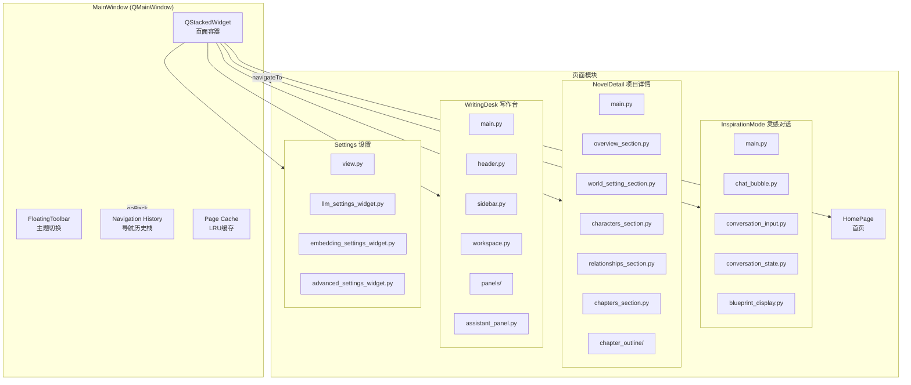

### 前端目录结构

```
frontend/
├── main.py                       # 应用入口
├── api/
│   ├── client/                   # API客户端（Mixin架构）
│   │   ├── core.py              # AFNAPIClient主类
│   │   ├── constants.py         # 超时配置常量
│   │   ├── novel_mixin.py       # 小说项目CRUD
│   │   ├── inspiration_mixin.py # 灵感对话
│   │   ├── blueprint_mixin.py   # 蓝图生成
│   │   ├── outline_mixin.py     # 大纲管理
│   │   ├── chapter_mixin.py     # 章节生成
│   │   ├── optimization_mixin.py# RAG和正文优化
│   │   ├── manga_mixin.py       # 漫画提示词
│   │   ├── config_mixin.py      # LLM/嵌入配置
│   │   ├── image_mixin.py       # 图片生成
│   │   ├── queue_mixin.py       # 任务队列
│   │   ├── portrait_mixin.py    # 角色立绘
│   │   ├── import_mixin.py      # 外部小说导入
│   │   ├── theme_config_mixin.py# 主题配置
│   │   └── protagonist_mixin.py # 主角档案
│   ├── manager.py                # API客户端单例管理
│   └── exceptions.py             # API异常定义
│
├── windows/
│   ├── main_window.py            # 主窗口（页面导航容器）
│   │
│   ├── inspiration_mode/         # 灵感对话模块
│   │   ├── main.py              # 主页面
│   │   ├── chat_bubble.py       # 聊天气泡组件
│   │   ├── conversation_input.py # 输入框组件
│   │   ├── conversation_state.py # 对话状态管理
│   │   ├── blueprint_display.py  # 蓝图展示
│   │   ├── blueprint_confirmation.py # 蓝图确认对话框
│   │   └── inspired_option_card.py # 灵感选项卡片
│   │
│   ├── novel_detail/             # 项目详情模块
│   │   ├── main.py              # 主页面
│   │   ├── overview_section.py  # 概览区域
│   │   ├── world_setting_section.py # 世界观设置
│   │   ├── characters_section.py # 角色管理
│   │   ├── relationships_section.py # 角色关系
│   │   ├── chapters_section.py  # 章节列表
│   │   └── chapter_outline/     # 章节大纲子模块
│   │       ├── main.py
│   │       ├── chapter_card.py
│   │       ├── part_outline_card.py
│   │       └── ...
│   │
│   ├── writing_desk/             # 写作台模块
│   │   ├── main.py              # 主页面
│   │   ├── header.py            # 顶部栏
│   │   ├── sidebar.py           # 章节侧边栏
│   │   ├── workspace.py         # 工作区
│   │   ├── chapter_card.py      # 章节卡片
│   │   ├── assistant_panel.py   # AI助手面板
│   │   ├── panels/              # 功能面板
│   │   │   ├── version_panel.py # 版本选择
│   │   │   ├── review_panel.py  # 评审面板
│   │   │   ├── analysis_panel.py # 分析面板
│   │   │   ├── content_panel.py # 内容编辑
│   │   │   └── summary_panel.py # 摘要面板
│   │   └── components/          # 写作台专用组件
│   │
│   └── settings/                 # 设置模块
│       ├── view.py              # 设置主视图
│       ├── llm_settings_widget.py # LLM配置
│       ├── embedding_settings_widget.py # 嵌入配置
│       └── advanced_settings_widget.py # 高级设置
│
├── pages/
│   └── home_page.py              # 首页
│
├── components/                   # 通用组件库
│   ├── base/
│   │   └── theme_aware_widget.py # 主题感知基类
│   └── ...
│
├── themes/                       # 主题系统
│   ├── theme_manager.py          # 主题管理器
│   ├── modern_effects.py         # 现代效果
│   └── svg_icons.py              # SVG图标
│
└── utils/                        # 工具类
    ├── async_worker.py           # 异步任务Worker
    ├── sse_worker.py             # SSE流式响应Worker
    ├── dpi_utils.py              # DPI感知工具
    ├── page_registry.py          # 页面注册表
    └── error_handler.py          # 错误处理
```

---

## 数据模型

### 实体关系图

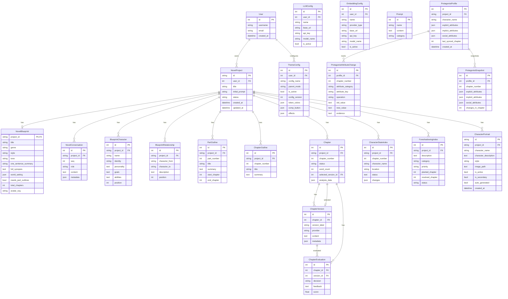

### 模型层级关系

```
NovelProject (项目主表)
├── NovelBlueprint (蓝图) [1:1]
├── NovelConversation (对话记录) [1:N]
├── BlueprintCharacter (角色) [1:N]
├── BlueprintRelationship (关系) [1:N]
├── PartOutline (分部大纲) [1:N]
├── ChapterOutline (章节大纲) [1:N]
├── Chapter (章节) [1:N]
│   ├── ChapterVersion (版本) [1:N]
│   │   └── ChapterEvaluation (评审) [1:N]
│   └── selected_version -> ChapterVersion [N:1]
├── CharacterPortrait (角色立绘) [1:N]
├── CharacterStateIndex (角色状态索引) [1:N]
└── ForeshadowingIndex (伏笔索引) [1:N]

ProtagonistProfile (主角档案主表)
├── ProtagonistAttributeChange (属性变更历史) [1:N]
├── ProtagonistBehaviorRecord (行为记录) [1:N]
├── ProtagonistDeletionMark (删除标记) [1:N]
└── ProtagonistSnapshot (状态快照) [1:N]

配置相关
├── LLMConfig (LLM配置)
├── EmbeddingConfig (嵌入配置)
├── ThemeConfig (主题配置)
├── User (用户)
└── Prompt (提示词模板)
```

---

## 核心业务流程

### 创作状态机

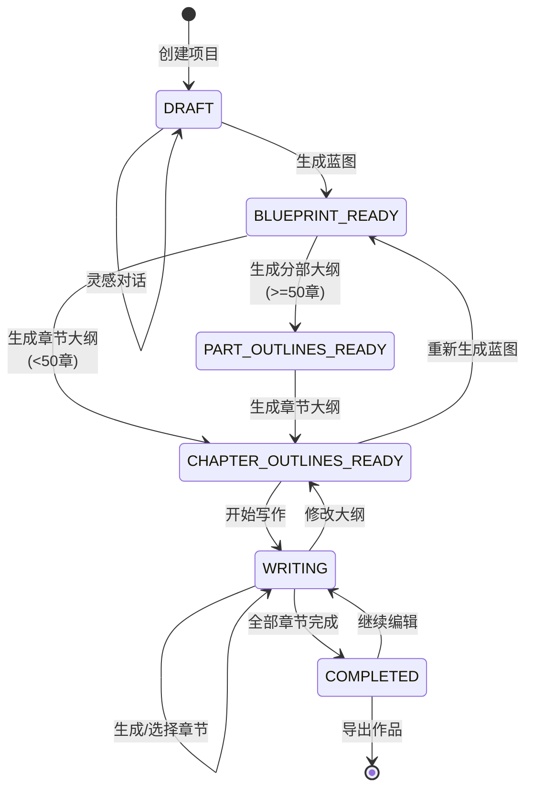

### 章节生成流程

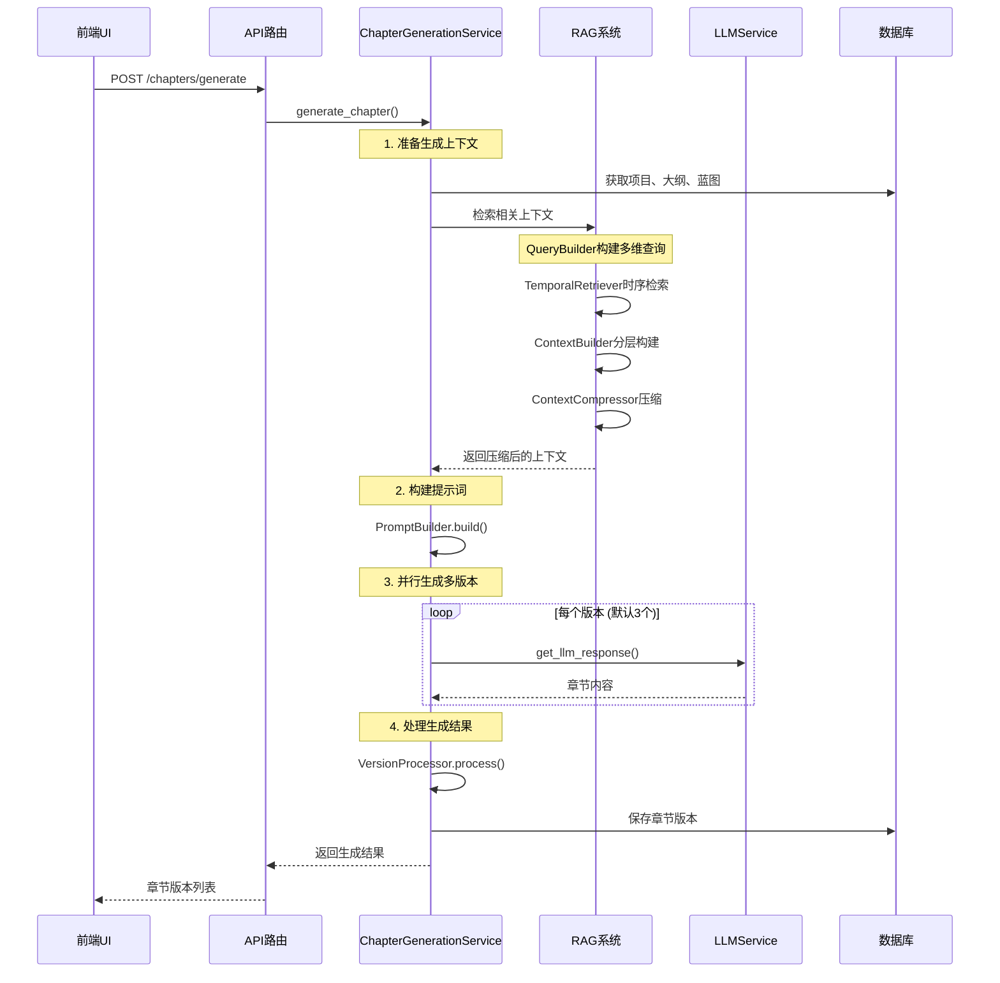

### 灵感对话流程

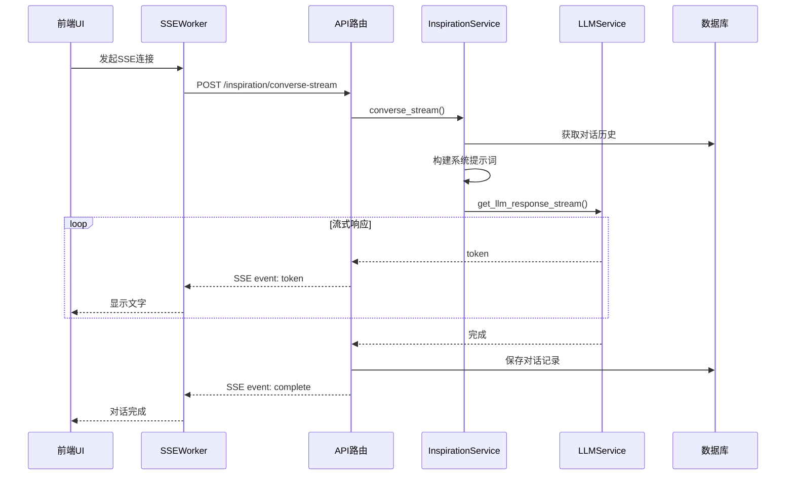

---

## 漫画分镜生成系统

### 系统概述

漫画分镜生成系统采用**页面驱动**的4步流水线架构，将小说章节内容转换为专业的漫画分镜和AI绘图提示词。

### 架构总览

```
┌─────────────────────────────────────────────────────────────────────────────┐
│                        漫画分镜生成系统架构                                    │
├─────────────────────────────────────────────────────────────────────────────┤
│                                                                             │
│  ┌─────────────────────────────────────────────────────────────────────┐   │
│  │                         输入                                         │   │
│  │  章节内容 + 风格设置 + 页数范围 + 角色立绘                             │   │
│  └─────────────────────────────────────────────────────────────────────┘   │
│                                    │                                        │
│                                    ▼                                        │
│  ┌─────────────────────────────────────────────────────────────────────┐   │
│  │ Step 1: 信息提取 (ChapterInfoExtractor)                              │   │
│  │  • 角色信息（外观/性格/关系）                                         │   │
│  │  • 对话信息（说话人/内容/情绪）                                       │   │
│  │  • 场景信息（地点/时间/氛围）                                         │   │
│  │  • 事件信息（动作/冲突/转折）                                         │   │
│  │  • 物品信息（关键道具/环境元素）                                      │   │
│  └─────────────────────────────────────────────────────────────────────┘   │
│                                    │                                        │
│                          ChapterInfo                                        │
│                                    │                                        │
│                                    ▼                                        │
│  ┌─────────────────────────────────────────────────────────────────────┐   │
│  │ Step 2: 页面规划 (PagePlanner)                                       │   │
│  │  • 全局页数分配                                                       │   │
│  │  • 事件到页面的映射                                                   │   │
│  │  • 节奏控制（快/中/慢）                                               │   │
│  │  • 页面角色（开场/发展/高潮/过渡/结尾）                                │   │
│  └─────────────────────────────────────────────────────────────────────┘   │
│                                    │                                        │
│                          PagePlanResult                                     │
│                                    │                                        │
│                                    ▼                                        │
│  ┌─────────────────────────────────────────────────────────────────────┐   │
│  │ Step 3: 分镜设计 (StoryboardDesigner)                                │   │
│  │  • 每页画格数量和布局                                                 │   │
│  │  • 画格大小/形状/镜头类型                                             │   │
│  │  • 对话气泡分配                                                       │   │
│  │  • 音效位置                                                           │   │
│  │  • 视觉焦点和构图                                                     │   │
│  └─────────────────────────────────────────────────────────────────────┘   │
│                                    │                                        │
│                         StoryboardResult                                    │
│                                    │                                        │
│                                    ▼                                        │
│  ┌─────────────────────────────────────────────────────────────────────┐   │
│  │ Step 4: 提示词构建 (PromptBuilder)                                   │   │
│  │  • 英文/中文双语提示词                                                │   │
│  │  • 负面提示词                                                         │   │
│  │  • 角色外观描述注入                                                   │   │
│  │  • 参考图路径（角色立绘）                                             │   │
│  └─────────────────────────────────────────────────────────────────────┘   │
│                                    │                                        │
│                                    ▼                                        │
│  ┌─────────────────────────────────────────────────────────────────────┐   │
│  │                         输出                                         │   │
│  │  MangaPromptResult (页面列表 + 画格提示词列表)                        │   │
│  └─────────────────────────────────────────────────────────────────────┘   │
│                                                                             │
└─────────────────────────────────────────────────────────────────────────────┘
```

### 流程时序图

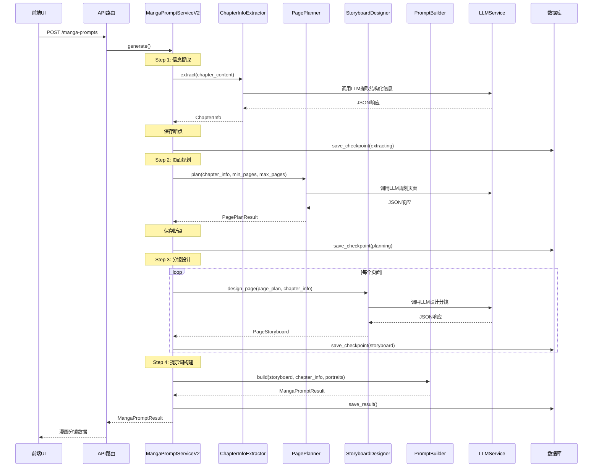

### 模块目录结构

```
backend/app/services/manga_prompt/
├── __init__.py                 # 模块入口，导出所有公共类
│
├── extraction/                 # Step 1: 信息提取
│   ├── __init__.py
│   ├── models.py              # ChapterInfo, CharacterInfo, DialogueInfo, etc.
│   ├── prompts.py             # 提取提示词模板
│   └── chapter_info_extractor.py  # ChapterInfoExtractor
│
├── planning/                   # Step 2: 页面规划
│   ├── __init__.py
│   ├── models.py              # PagePlanResult, PagePlanItem, PacingType, PageRole
│   ├── prompts.py             # 规划提示词模板
│   └── page_planner.py        # PagePlanner
│
├── storyboard/                 # Step 3: 分镜设计
│   ├── __init__.py
│   ├── models.py              # StoryboardResult, PageStoryboard, PanelDesign
│   ├── prompts.py             # 分镜提示词模板
│   └── designer.py            # StoryboardDesigner
│
├── prompt_builder/             # Step 4: 提示词构建
│   ├── __init__.py
│   ├── models.py              # MangaPromptResult, PagePromptResult, PanelPrompt
│   └── builder.py             # PromptBuilder
│
└── core/                       # 核心服务
    ├── __init__.py
    ├── service.py             # MangaPromptServiceV2 主服务
    ├── models.py              # MangaStyle 枚举
    ├── checkpoint_manager.py  # 断点管理（支持断点续传）
    └── result_persistence.py  # 结果持久化
```

### 核心数据结构

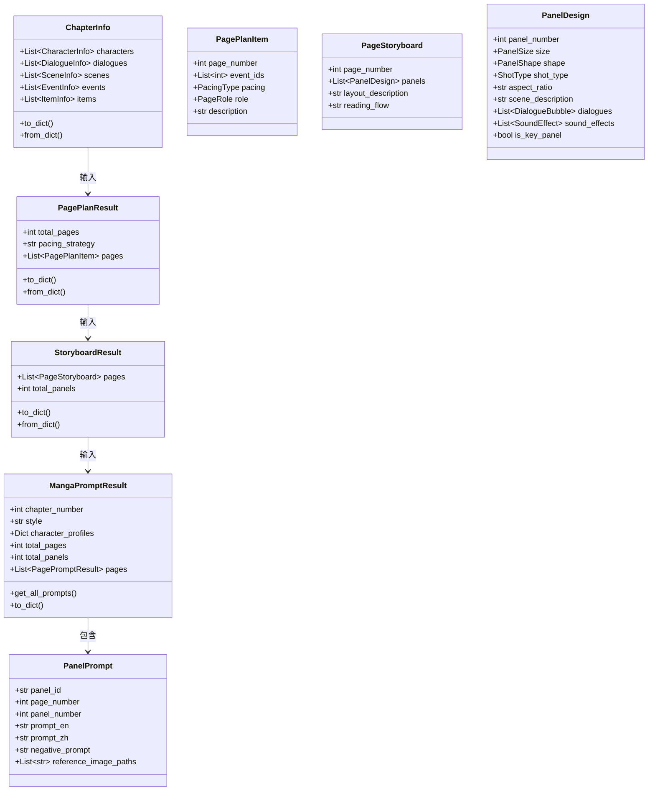

### 枚举类型

| 枚举 | 值 | 说明 |
|------|-----|------|
| **PacingType** | fast, medium, slow | 节奏类型 |
| **PageRole** | opening, development, climax, transition, ending | 页面角色 |
| **ShotType** | extreme_close_up, close_up, medium_close, medium, medium_long, long, extreme_long, birds_eye, worms_eye | 镜头类型 |
| **PanelSize** | small, medium, large, full_page, double_page | 画格大小 |
| **PanelShape** | rectangle, square, vertical, horizontal, diagonal, irregular, circular | 画格形状 |
| **MangaStyle** | manga, anime, comic, webtoon | 漫画风格 |

### 断点续传机制

系统支持长时间生成任务的断点续传：

```
┌─────────────────────────────────────────────────────────────────┐
│                      断点续传状态流转                             │
├─────────────────────────────────────────────────────────────────┤
│                                                                 │
│  pending ──▶ extracting ──▶ planning ──▶ storyboard ──▶ completed │
│                                                                 │
│  每个阶段完成后保存断点数据到数据库：                               │
│  • chapter_info (提取结果)                                       │
│  • page_plan (规划结果)                                          │
│  • storyboard (分镜结果，按页累积)                                │
│                                                                 │
│  断点恢复时：                                                     │
│  1. 读取断点数据                                                 │
│  2. 跳过已完成阶段                                               │
│  3. 从断点位置继续执行                                           │
│                                                                 │
└─────────────────────────────────────────────────────────────────┘
```

### API接口

| 方法 | 端点 | 说明 |
|------|------|------|
| POST | `/api/writer/novels/{id}/chapters/{num}/manga-prompts` | 生成漫画分镜 |
| GET | `/api/writer/novels/{id}/chapters/{num}/manga-prompts` | 获取已保存的分镜 |
| DELETE | `/api/writer/novels/{id}/chapters/{num}/manga-prompts` | 删除分镜数据 |
| GET | `/api/writer/novels/{id}/chapters/{num}/manga-prompts/progress` | 获取生成进度 |

### 请求参数

```json
{
    "style": "manga",           // 风格: manga/anime/comic/webtoon
    "min_pages": 8,             // 最少页数 (3-20)
    "max_pages": 15,            // 最多页数 (5-30)
    "language": "chinese",      // 语言: chinese/japanese/english/korean
    "use_portraits": true,      // 使用角色立绘作为参考图
    "auto_generate_portraits": true  // 自动生成缺失立绘
}
```

### 响应结构

```json
{
    "chapter_number": 1,
    "style": "manga",
    "character_profiles": {
        "主角": "黑发少年，身穿校服..."
    },
    "total_pages": 12,
    "total_panels": 48,
    "pages": [
        {
            "page_number": 1,
            "panel_count": 4,
            "layout_description": "四格标准布局",
            "reading_flow": "right_to_left"
        }
    ],
    "panels": [
        {
            "panel_id": "p1_panel1",
            "page_number": 1,
            "panel_number": 1,
            "size": "medium",
            "shape": "rectangle",
            "shot_type": "medium",
            "aspect_ratio": "4:3",
            "prompt_en": "A young man with black hair...",
            "prompt_zh": "一个黑发少年...",
            "negative_prompt": "blurry, low quality...",
            "dialogues": [...],
            "characters": ["主角"],
            "reference_image_paths": ["/portraits/protagonist.png"]
        }
    ]
}
```

---

## RAG系统架构

### RAG数据流

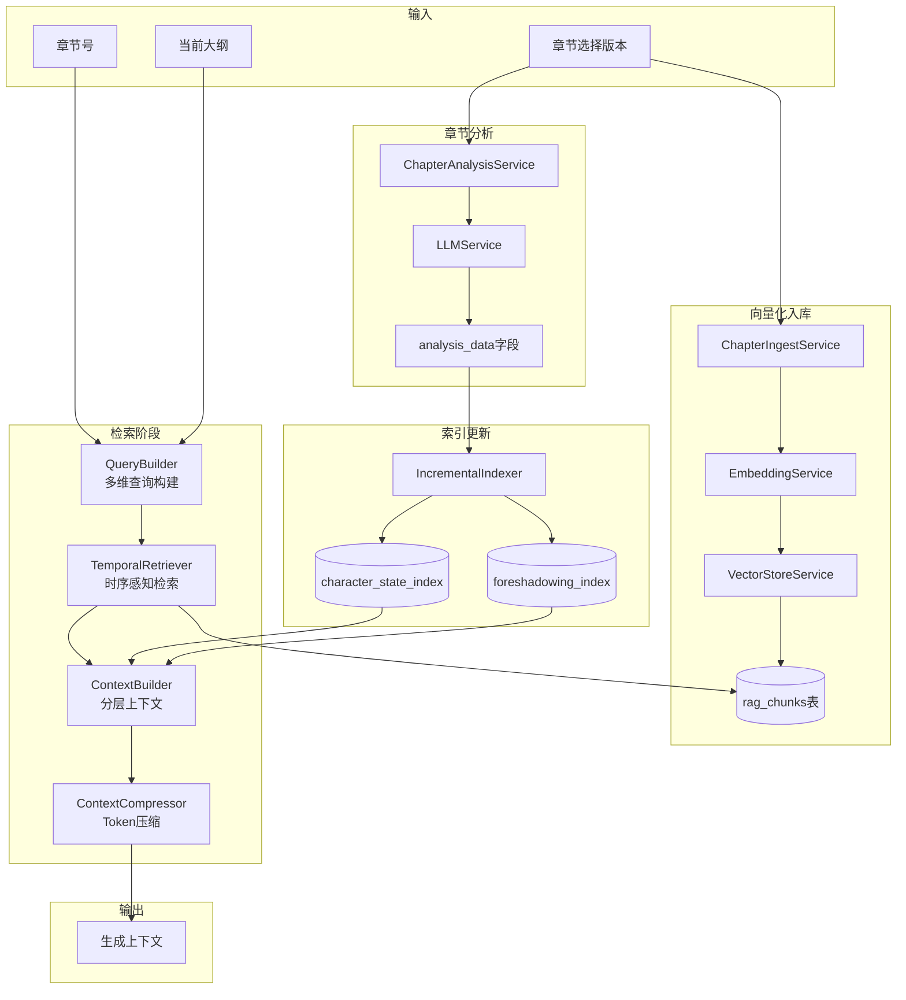

### RAG上下文分层

```
┌─────────────────────────────────────────────────────────────────┐
│                      RAG上下文分层结构                           │
├─────────────────────────────────────────────────────────────────┤
│                                                                 │
│  ┌─────────────────────────────────────────────────────────┐   │
│  │ 必需层 (Required) - 始终包含                             │   │
│  │  • 蓝图核心信息（标题、类型、风格、基调）                    │   │
│  │  • 角色名称列表                                          │   │
│  │  • 当前章节大纲                                          │   │
│  │  • 前一章结尾片段 (500-1000字)                           │   │
│  └─────────────────────────────────────────────────────────┘   │
│                              ↓                                  │
│  ┌─────────────────────────────────────────────────────────┐   │
│  │ 重要层 (Important) - 优先包含                            │   │
│  │  • 本章涉及角色的详细信息                                  │   │
│  │  • 高优先级待回收伏笔                                     │   │
│  │  • 前3章压缩摘要                                         │   │
│  │  • RAG检索的高相关度片段                                  │   │
│  └─────────────────────────────────────────────────────────┘   │
│                              ↓                                  │
│  ┌─────────────────────────────────────────────────────────┐   │
│  │ 参考层 (Reference) - Token允许时包含                     │   │
│  │  • 世界观设定                                            │   │
│  │  • 中等优先级伏笔                                        │   │
│  │  • RAG检索的中等相关度片段                                │   │
│  │  • 角色关系网络                                          │   │
│  └─────────────────────────────────────────────────────────┘   │
│                                                                 │
│  Token限制: 根据模型上下文窗口动态调整 (默认约8000 tokens)       │
│                                                                 │
└─────────────────────────────────────────────────────────────────┘
```

### RAG组件职责

| 组件 | 职责 | 输入 | 输出 |
|------|------|------|------|
| `QueryBuilder` | 构建多维检索查询 | 大纲、角色、伏笔 | 查询向量列表 |
| `TemporalRetriever` | 时序感知的向量检索 | 查询向量、章节号 | 带权重的片段列表 |
| `ContextBuilder` | 分层构建上下文 | 蓝图、检索结果、分析数据 | 结构化上下文 |
| `ContextCompressor` | 压缩至Token限制 | 完整上下文、Token限制 | 压缩后的上下文 |
| `OutlineRetriever` | 大纲阶段的RAG | 已有大纲、蓝图 | 相关大纲片段 |
| `SceneExtractor` | 提取场景状态 | 章节内容 | 场景状态数据 |

---

## 主角档案系统

### 系统概述

主角档案系统用于追踪主角的属性变化和行为模式，支持类Git的状态快照和回滚功能。

### 核心功能

```
┌─────────────────────────────────────────────────────────────────┐
│                       主角档案系统架构                            │
├─────────────────────────────────────────────────────────────────┤
│                                                                 │
│  三类属性追踪:                                                   │
│  ┌─────────────────────────────────────────────────────────┐   │
│  │ 显性属性 (explicit)                                      │   │
│  │  • 外貌特征、装备、技能等可直接观测的属性                   │   │
│  │  • 结构由LLM自主决定                                      │   │
│  └─────────────────────────────────────────────────────────┘   │
│  ┌─────────────────────────────────────────────────────────┐   │
│  │ 隐性属性 (implicit)                                      │   │
│  │  • 性格特点、行为习惯、价值观等内在特质                    │   │
│  │  • 通过行为记录分析得出                                   │   │
│  └─────────────────────────────────────────────────────────┘   │
│  ┌─────────────────────────────────────────────────────────┐   │
│  │ 社会属性 (social)                                        │   │
│  │  • 人际关系、社会地位、组织归属等                         │   │
│  └─────────────────────────────────────────────────────────┘   │
│                                                                 │
│  证据溯源: 所有属性变更必须附带原文引用作为证据                   │
│                                                                 │
└─────────────────────────────────────────────────────────────────┘
```

### 数据模型

| 模型 | 说明 |
|------|------|
| `ProtagonistProfile` | 主角档案主表，存储三类属性JSON |
| `ProtagonistAttributeChange` | 属性变更历史，包含证据溯源 |
| `ProtagonistBehaviorRecord` | 行为记录，用于隐性属性分析 |
| `ProtagonistDeletionMark` | 删除标记，实现5次连续标记保护机制 |
| `ProtagonistSnapshot` | 状态快照，类Git节点，支持时间旅行和回滚 |

### 类Git状态管理

```
章节同步后创建快照节点:

  Ch.1 ──► Ch.2 ──► Ch.3 ──► Ch.5 ──► Ch.8 (当前)
   │        │        │        │        │
   ▼        ▼        ▼        ▼        ▼
 Snap1   Snap2    Snap3    Snap5    Snap8

功能:
• 时间旅行: get_state_at_chapter(chapter_number)
• 差异比较: diff_between_chapters(from, to)
• 状态回滚: rollback_to_chapter(target_chapter)
```

### 删除保护机制

```
属性删除需连续5次标记:

  Mark1 ──► Mark2 ──► Mark3 ──► Mark4 ──► Mark5 ──► 实际删除
    │                    │
    └── 属性被引用 ───────┘ (计数重置为0)

防止误删:
• 连续5章标记同一属性才执行删除
• 期间属性被使用则重置计数
```

---

## 正文优化Agent系统

### 系统概述

正文优化Agent采用ReAct (思考-行动-观察) 循环，逐段分析章节内容，检测问题并生成修改建议。

### 架构图

```
┌─────────────────────────────────────────────────────────────────┐
│                     正文优化Agent架构                            │
├─────────────────────────────────────────────────────────────────┤
│                                                                 │
│   用户请求                                                       │
│      │                                                          │
│      ▼                                                          │
│  ┌─────────────────────────────────────────────────────────┐   │
│  │                   Agent主循环                            │   │
│  │  ┌─────────┐    ┌─────────┐    ┌─────────┐             │   │
│  │  │ 思考    │ ──►│ 决策    │ ──►│ 执行    │             │   │
│  │  │Thinking │    │ Action  │    │Execute  │             │   │
│  │  └─────────┘    └─────────┘    └────┬────┘             │   │
│  │       ▲                             │                   │   │
│  │       │         ┌─────────┐         │                   │   │
│  │       └─────────│ 观察    │ ◄───────┘                   │   │
│  │                 │Observe  │                             │   │
│  │                 └─────────┘                             │   │
│  └─────────────────────────────────────────────────────────┘   │
│                          │                                      │
│                          ▼                                      │
│  ┌─────────────────────────────────────────────────────────┐   │
│  │                    工具集                                │   │
│  │  analyze_paragraph  │  rag_retrieve  │  check_coherence │   │
│  │  get_character_state│  check_timeline│  generate_suggest│   │
│  │  next_paragraph     │  finish_analysis│ complete_workflow│   │
│  └─────────────────────────────────────────────────────────┘   │
│                                                                 │
└─────────────────────────────────────────────────────────────────┘
```

### 检查维度

| 维度 | 说明 | 工具 |
|------|------|------|
| `coherence` | 逻辑连贯性 | `check_coherence` |
| `character` | 角色一致性 | `get_character_state` |
| `foreshadow` | 伏笔呼应 | `rag_retrieve` |
| `timeline` | 时间线一致性 | `check_timeline` |
| `style` | 风格一致性 | `analyze_paragraph` |
| `scene` | 场景描写 | `analyze_paragraph` |

### 工作流程

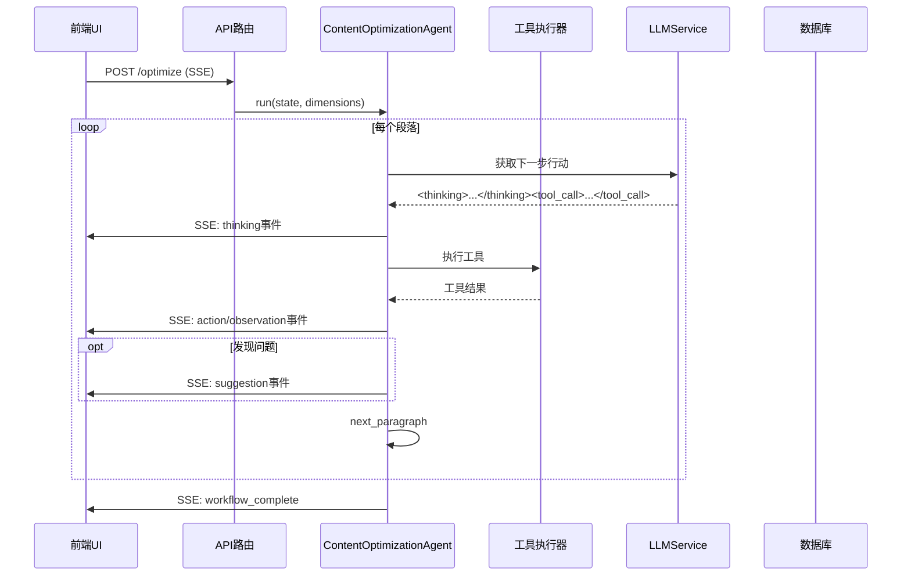

### 运行模式

| 模式 | 说明 |
|------|------|
| `AUTO` | 自动模式，Agent自主决定是否采纳建议 |
| `REVIEW` | 审核模式，每个建议暂停等待用户确认 |

### SSE事件类型

| 事件 | 说明 |
|------|------|
| `workflow_start` | 工作流开始 |
| `paragraph_start` | 开始分析新段落 |
| `thinking` | Agent思考过程 |
| `action` | Agent选择的动作 |
| `observation` | 工具执行结果 |
| `suggestion` | 生成的修改建议 |
| `paragraph_complete` | 段落分析完成 |
| `workflow_paused` | 工作流暂停(REVIEW模式) |
| `workflow_resumed` | 工作流恢复 |
| `workflow_complete` | 工作流完成 |
| `error` | 错误信息 |

---

## 请求队列系统

### 概述

基于asyncio.Semaphore实现的并发控制系统，用于限制LLM和图片生成请求的并发数。

### 架构

```
┌─────────────────────────────────────────────────────────────────┐
│                      请求队列系统                                │
├─────────────────────────────────────────────────────────────────┤
│                                                                 │
│  ┌────────────────────────┐   ┌────────────────────────┐       │
│  │     LLM请求队列         │   │    图片生成请求队列     │       │
│  │                        │   │                        │       │
│  │  Semaphore(3)          │   │  Semaphore(2)          │       │
│  │  • 活跃数: 2           │   │  • 活跃数: 1           │       │
│  │  • 等待数: 5           │   │  • 等待数: 3           │       │
│  │  • 已处理: 128         │   │  • 已处理: 42          │       │
│  └────────────────────────┘   └────────────────────────┘       │
│                                                                 │
│  功能:                                                          │
│  • 最大并发数限制                                                │
│  • 状态跟踪 (active/waiting/processed)                          │
│  • 动态调整并发数                                                │
│  • 上下文管理器自动获取/释放槽位                                  │
│                                                                 │
└─────────────────────────────────────────────────────────────────┘
```

### 使用示例

```python
# 获取队列槽位
async with queue.request_slot():
    response = await llm_service.generate(...)

# 获取队列状态
status = queue.get_status()
# {"active": 2, "waiting": 5, "max_concurrent": 3, "total_processed": 128}
```

---

## 通信机制

### HTTP REST API

```
前端 (AFNAPIClient)  ────────────────>  后端 (FastAPI)
                     HTTP Request

        • GET/POST/PUT/DELETE
        • JSON请求/响应
        • 超时配置 (10-600秒)
        • 自动重试 (502/503/504)
        • 异常类型映射
```

### SSE (Server-Sent Events)

```
前端 (SSEWorker)  <────────────────  后端 (StreamingResponse)
                   SSE Events

事件类型:
├── token     : {"token": "字符"}        # 流式文本
├── thinking  : {"content": "..."}       # 思考过程
├── complete  : {"is_complete": true}    # 完成信号
└── error     : {"message": "..."}       # 错误信息
```

### 前端异步处理

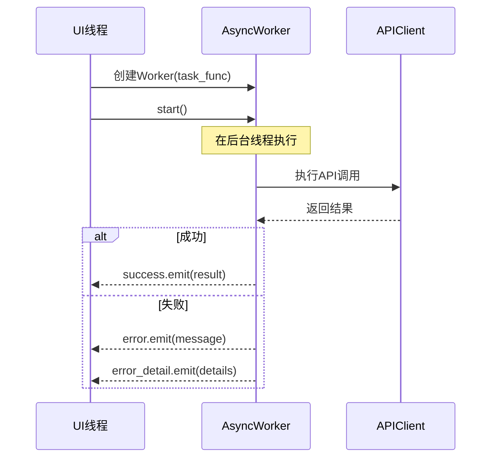

---

## 依赖注入

### FastAPI依赖图

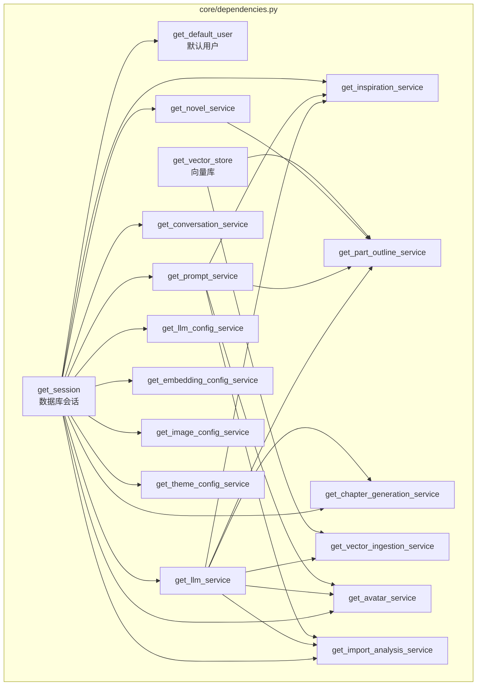

---

## 技术栈总结

| 层级 | 技术 | 版本 |
|------|------|------|
| **前端框架** | PyQt6 | 6.6.1 |
| **后端框架** | FastAPI | 0.110.0 |
| **ORM** | SQLAlchemy | 2.0 (异步) |
| **数据库驱动** | aiosqlite | - |
| **数据库** | SQLite | - |
| **向量库** | ChromaDB | - |
| **HTTP客户端** | requests | - |
| **异步运行时** | asyncio | - |
| **LLM集成** | OpenAI兼容API | - |

---

## 文件索引

### 后端关键文件

| 文件 | 说明 |
|------|------|
| `backend/app/main.py` | FastAPI应用入口 |
| `backend/app/core/dependencies.py` | 依赖注入 |
| `backend/app/core/state_machine.py` | 项目状态机 |
| `backend/app/exceptions.py` | 统一异常体系 |
| `backend/app/models/novel.py` | 核心数据模型 |
| `backend/app/models/protagonist.py` | 主角档案数据模型 |
| `backend/app/services/llm_service.py` | LLM调用封装 |
| `backend/app/services/chapter_generation/service.py` | 章节生成服务 |
| `backend/app/services/rag/context_builder.py` | RAG上下文构建 |
| `backend/app/services/protagonist_profile/service.py` | 主角档案服务 |
| `backend/app/services/content_optimization/agent.py` | 正文优化Agent |
| `backend/app/services/queue/base.py` | 请求队列基类 |

### 前端关键文件

| 文件 | 说明 |
|------|------|
| `frontend/main.py` | PyQt6应用入口 |
| `frontend/windows/main_window.py` | 主窗口导航 |
| `frontend/api/client/core.py` | API客户端核心 |
| `frontend/api/client/*_mixin.py` | API客户端Mixin模块 |
| `frontend/utils/async_worker.py` | 异步任务处理 |
| `frontend/utils/sse_worker.py` | SSE流式响应 |
| `frontend/themes/theme_manager/` | 主题管理模块 |
| `frontend/components/base/theme_aware_widget.py` | 主题感知组件基类 |

---

*文档更新时间: 2025年1月*
*项目版本: 1.0.0-pyqt*
