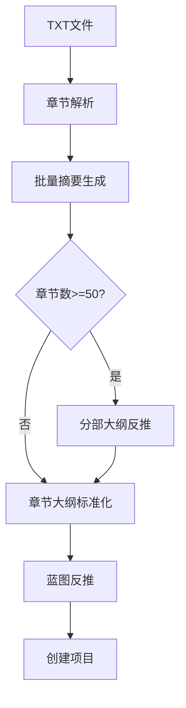

# 生成阶段信息使用审查报告

本报告对比 README.md 中描述的各生成阶段信息使用与项目实际实现情况。

---

## 1. 灵感对话阶段

### README中的描述

- 与AI进行互动式对话，引导构建完整的小说概念
- **智能引导**：AI根据对话进展动态调整问题
- **灵感选项**：每轮提供3-5个差异化方向供选择
- **自由输入**：随时可以输入自己的想法
- **信息收集**：自动收集类型、风格、主角、冲突等核心要素
- **章节规划**：确定预期篇幅（5-10000章）

### 实际实现

**位置**: `backend/prompts/inspiration.md`, `backend/app/services/inspiration_service.py`

**信息使用**:
- 使用对话历史 + 当前用户输入作为LLM输入
- 系统提示词定义AI角色为"小说概念大师·文思"
- 内部信息核对清单包含：核心灵感、题材基调、文风格调、主角雏形、核心冲突、对手/障碍、导火索事件、核心主题、作品命名、预期篇幅
- 章节数范围：5-10000章（与README一致）
- 输出`inspired_options`提供灵感选项（label, description, key_elements）

### 审查结论

**一致** - 实际实现与README描述完全一致。提示词中的信息核对清单覆盖了README提到的所有要素。

---

## 2. 蓝图生成阶段

### README中的描述

```
蓝图结构
├── 基本信息（标题、类型、风格、基调）
├── 世界观设定
│   ├── 核心规则
│   ├── 关键地点
│   └── 势力派系
├── 角色设定
│   ├── 角色档案（身份、性格、目标、能力）
│   └── 角色关系网
└── 故事大纲（一句话概括 + 完整大纲）
```

### 实际实现

**位置**: `backend/prompts/screenwriting.md`, `backend/app/services/blueprint_service.py`, `backend/app/api/routers/novels/blueprints.py`

**信息使用**:
- 输入：灵感对话的完整历史记录（JSON格式）
- 输出JSON结构：
  - `title`, `target_audience`, `genre`, `style`, `tone`
  - `one_sentence_summary`, `full_synopsis`（500-800字）
  - `world_setting`: `core_rules`, `key_locations[]`, `factions[]`
  - `characters[]`: `name`, `identity`, `personality`, `goals`, `abilities`, `relationship_to_protagonist`
  - `relationships[]`: `character_from`, `character_to`, `description`
  - `chapter_outline`: **强制为空数组[]**（章节大纲在后续阶段生成）
  - `needs_part_outlines`: 根据章节数自动判断（>=50章为true）
  - `total_chapters`: 从对话中提取或推断

**关键处理**:
- `validate_and_clean_blueprint()`: 即使LLM违反指令生成了章节大纲，也会强制清空
- `extract_total_chapters()`: 优先从对话state提取，次之正则匹配用户消息，最后按对话轮次推断默认值（30/80/150）

### 审查结论

**一致** - 蓝图结构与README描述完全一致。实际实现还额外增加了：
- `target_audience`（目标读者）
- `chapters_per_part`（每部分章节数，默认25）
- 强制章节大纲为空的保护机制

---

## 3. 分部大纲生成阶段

### README中的描述

- 长篇（>=50章）需要分部大纲 → 章节大纲的双层结构
- **分部大纲**：每部分约25章，包含主题、关键事件、角色成长弧线

### 实际实现

**位置**: `backend/prompts/part_outline_single.md`, `backend/prompts/part_outline.md`, `backend/app/services/prompt_builder.py`

**信息使用**（串行模式）:
- 输入：
  - `total_chapters`: 总章节数
  - `chapters_per_part`: 每部分章节数（约25）
  - `total_parts`: 总部分数
  - `world_setting`: 世界观设定
  - `characters`: 角色列表
  - `full_synopsis`: 完整剧情简介
  - `current_part_number`: 当前要生成的部分编号
  - `previous_parts`: 前面已生成的部分列表（用于保持连贯性）
  - `optimization_prompt`: 用户特别要求（可选）

- 输出JSON结构：
  - `part_number`, `title`, `start_chapter`, `end_chapter`
  - `summary`（200-300字详细摘要）
  - `theme`: 核心主题
  - `key_events[]`: 关键事件（3-5个）
  - `character_arcs{}`: 角色成长弧线
  - `conflicts[]`: 冲突描述
  - `ending_hook`: 结尾悬念（20-50字）

**批量模式额外输出**:
- `overall_structure`: 整体结构描述（story_phases, major_turning_points）

### 审查结论

**一致** - 实际实现完全覆盖README描述，还额外提供了：
- 两种生成模式（串行/批量）
- 前后部分上下文传递机制
- ending_hook长度限制（防止JSON截断）

---

## 4. 章节大纲生成阶段

### README中的描述

- **章节大纲**：每章标题 + 100-200字摘要，包含冲突、转折、悬念

### 实际实现

**位置**: `backend/prompts/outline.md`, `backend/prompts/part_chapters.md`, `backend/app/services/prompt_builder.py`

**信息使用**（从part生成章节大纲）:
- 输入：
  - `novel_blueprint`: 完整蓝图数据
  - `wait_to_generate`: `start_chapter`, `num_chapters`
  - `previous_chapters`: 前面已生成的章节大纲（最近10章）
  - `relevant_completed_chapters`: **RAG检索的相关已完成章节摘要**（可选）

- `build_part_chapters_prompt()`额外构建的上下文：
  - 部分大纲信息（标题、主题、关键事件、冲突、角色发展）
  - 上一部分的`ending_hook`
  - 下一部分的`summary`
  - 世界观设定、角色档案

- 输出JSON结构（outline.md）：
  ```json
  {
    "chapters": [
      {
        "chapter_number": int,
        "title": "章节标题（6-15字）",
        "summary": "章节概要（100-200字）"
      }
    ]
  }
  ```

- 输出JSON结构（part_chapters.md）：
  ```json
  {
    "chapter_outline": [...]
  }
  ```

### 审查结论

**一致** - 与README描述一致。注意两个提示词使用不同的输出字段名：
- `outline.md` 使用 `chapters`
- `part_chapters.md` 使用 `chapter_outline`

这是有意设计：不同场景使用不同的提示词。

---

## 5. 章节生成阶段（含RAG）

### README中的描述

#### RAG上下文分层

```
必需层 - 始终包含
├── 蓝图核心信息
├── 角色名称列表
├── 当前章节大纲
└── 前一章结尾片段

重要层 - 优先包含
├── 本章涉及角色详情
├── 高优先级待回收伏笔
├── 前3章压缩摘要
└── 高相关度检索片段

参考层 - Token允许时包含
├── 世界观设定
├── 中等优先级伏笔
├── 角色关系网络
└── 中等相关度片段
```

### 实际实现

**位置**:
- `backend/app/services/chapter_generation/service.py`
- `backend/app/services/chapter_generation/prompt_builder.py`
- `backend/app/services/rag/context_builder.py`
- `backend/prompts/writing.md`

**信息使用**:

#### SmartContextBuilder 分层实现 (`context_builder.py:110-154`)

**必需层 `_build_must_have_layer()`**:
- `story_basics`: title, genre, style, tone, one_sentence_summary
- `character_names`: 角色名称列表（核心约束）
- `current_outline`: chapter_number, title, summary
- `prev_ending_state`: 前一章结尾状态（角色位置、未解悬念、关键事件、情感基调）

**重要层 `_build_important_layer()`**:
- `involved_characters`: 涉及角色详情（最多5个）
- `character_relationships`: 涉及角色的关系
- `high_priority_foreshadowing`: 高优先级伏笔（最多3个）
- `prev_character_states`: 前一章角色状态
- `relevant_summaries`: 最相关的章节摘要（最多3个）

**参考层 `_build_reference_layer()`**:
- `world_setting`: 世界观设定
- `full_synopsis`: 完整故事大纲（截断500字）
- `relevant_passages`: RAG检索的文本片段（最多5个chunk）
- `other_foreshadowing`: 中低优先级伏笔（最多5个）

#### ChapterPromptBuilder 提示词构建 (`prompt_builder.py`)

最终提示词结构：
1. **核心设定**: 题材、风格、角色名单、一句话概括
2. **当前任务**: 章节号、标题、大纲摘要、写作指令
3. **场景状态**: 角色位置、上一章结尾、上一章摘要
4. **关键参考**: 涉及角色详情、待回收伏笔、相关段落、前情摘要

#### ChapterGenerationService 完整流程 (`service.py`)

1. `prepare_generation_context()`:
   - 构建`BlueprintInfo`
   - 获取前一章分析数据`prev_chapter_analysis`
   - 获取待回收伏笔`pending_foreshadowing`（最多5个）
   - 执行增强型RAG检索`EnhancedChapterContextService.retrieve_enhanced_context()`

2. `collect_chapter_summaries()`: 收集已完成章节摘要（批量并行生成缺失的摘要）

3. `generate_chapter_versions()`: 并行/串行生成多版本

### 审查结论

**一致** - 实际实现与README描述的RAG分层结构完全一致：

| README描述 | 实际实现位置 |
|-----------|-------------|
| 蓝图核心信息 | must_have.story_basics |
| 角色名称列表 | must_have.character_names |
| 当前章节大纲 | must_have.current_outline |
| 前一章结尾片段 | must_have.prev_ending_state + scene_section |
| 本章涉及角色详情 | important.involved_characters |
| 高优先级待回收伏笔 | important.high_priority_foreshadowing |
| 前3章压缩摘要 | important.relevant_summaries |
| 高相关度检索片段 | important.relevant_summaries (来自RAG) |
| 世界观设定 | reference.world_setting |
| 中等优先级伏笔 | reference.other_foreshadowing |
| 角色关系网络 | important.character_relationships |
| 中等相关度片段 | reference.relevant_passages |

---

## 6. 正文优化阶段

### README中的描述

基于ReAct循环的Agent系统，逐段检查：
- **逻辑连贯性**：因果关系、情节过渡
- **角色一致性**：性格、能力、状态
- **伏笔呼应**：铺垫、回收
- **时间线一致性**：时间流逝、事件顺序
- **风格一致性**：叙事风格、用词习惯
- **场景描写**：环境细节、空间关系

### 实际实现

**位置**: `backend/app/services/content_optimization/service.py`, `workflow.py`

**信息使用**:

#### 上下文加载 `_load_context()`:
- `blueprint_core`: 标题、类型、风格、基调
- `character_names`: 角色名称列表
- `prev_chapter_ending`: 前章结尾（最后500字）
- `style_guide`: 风格指南
- `total_chapters`: 总章节数（用于时序感知检索）

#### Agent工具执行器 `ToolExecutor`:
- `vector_store`: 向量存储（RAG检索）
- `paragraph_analyzer`: 段落分析器
- `embedding_service`: 嵌入服务（时序感知检索）
- `character_index=True`: 启用角色状态索引查询
- `foreshadowing_index=True`: 启用伏笔索引查询
- `llm_service`: 用于深度LLM检查

#### 检查维度（CheckDimension）:
- `coherence`: 逻辑连贯
- `character`: 角色一致
- `foreshadow`: 伏笔呼应
- `timeline`: 时间线
- `style`: 风格
- `scene`: 场景

### 审查结论

**一致** - 实际实现的6个检查维度与README描述完全对应。Agent驱动模式能够根据环境自主决定调用哪些工具和执行哪些检查。

---

## 7. 漫画转化阶段

### README中的描述


- **场景分割**：自动识别场景切换点
- **分格规划**：根据场景设计漫画分格
- **提示词生成**：生成适配AI绘图的英文提示词
- **多语言支持**：提示词支持中英文

### 实际实现

**位置**: `backend/app/services/manga_prompt/core_v2.py`

**信息使用**:

#### 场景提取 `_extract_scenes()`:
- 输入：章节内容（截取前8000字）、min_scenes、max_scenes、dialogue_language
- 输出：
  - `scenes[]`: scene_id, summary, content, characters, mood, importance, has_dialogue, is_action
  - `character_profiles{}`: 角色外观描述（英文，用于AI绘图）

#### 场景展开 `_expand_scenes_with_checkpoint()`:
- 使用`SceneExpansionService`展开每个场景为页面+画格
- 上下文信息：prev_summary, next_summary, chapter_position
- 支持LLM动态布局 (`use_dynamic_layout`)

#### 提示词生成:
- 使用`PanelPromptBuilder`为每个画格生成提示词
- 输出结构：
  - `prompt_en`: 英文提示词
  - `prompt_zh`: 中文提示词
  - `negative_prompt`: 负面提示词
  - 文字元素：dialogue, dialogue_speaker, narration, sound_effects
  - 视觉信息：characters, composition, camera_angle, lighting, atmosphere

#### 多语言支持:
- `dialogue_language`: chinese/japanese/english/korean
- 角色描述强制使用英文（用于AI绘图）

### 审查结论

**一致** - 实际实现与README流程图完全一致：
1. 章节内容 → 场景提取（`_extract_scenes`）
2. 场景分割 → 场景展开（`_expand_scenes_with_checkpoint`）
3. 分格规划 → 页面模板 + 动态布局
4. 提示词生成 → `PanelPromptBuilder`
5. 图片生成/PDF导出 → `ImageGenerationService`

---

## 8. 外部导入分析阶段

### README中的描述



### 实际实现

**位置**: `backend/app/services/import_analysis/service.py`

**信息使用**:

#### 分析流程阶段:
1. **generating_analysis_data**: 逐章生成分析数据（最重要）
2. **analyzing_chapters**: 逐章生成摘要（利用analysis_data）
3. **generating_outlines**: 更新章节大纲
4. **generating_part_outlines**: 生成分部大纲（仅长篇>=50章）
5. **extracting_blueprint**: 反推蓝图

#### 上下文限制优化:
- `MAX_CHAPTERS_FOR_LLM_OUTLINE = 100`: 超过此数量跳过LLM标准化
- `MAX_CHAPTERS_PER_PART_BATCH = 30`: 分部大纲每批处理的章节数
- `MAX_SUMMARIES_FOR_BLUEPRINT = 50`: 蓝图反推最多使用的摘要数
- `MAX_SUMMARY_LENGTH = 150`: 蓝图反推时单章摘要最大长度

#### 蓝图反推 `_extract_blueprint()` 信息使用:
- `chapter_summaries`: 压缩后的摘要列表（采样）
- `sample_chapters`: 抽样章节内容（最多10章，每章6000字）
- `extracted_characters`: 从analysis_data提取的角色（最多20个）
- `extracted_foreshadowing`: 从analysis_data提取的伏笔（最多30个）
- `part_outlines`: 分部大纲信息（如果有）

#### 断点续传支持:
- 已生成的analysis_data和摘要会被复用
- 每个阶段可以从中断处继续

### 审查结论

**一致** - 实际实现与README流程图一致，且增加了：
- analysis_data生成作为第一步（为后续步骤提供基础）
- 上下文限制优化（防止LLM上下文爆炸）
- 断点续传支持

---

## 总结

### 一致性确认

| 阶段 | 状态 | 说明 |
|------|------|------|
| 灵感对话 | 完全一致 | - |
| 蓝图生成 | 完全一致 | 实现增加了额外保护机制 |
| 分部大纲生成 | 完全一致 | 提供串行/批量两种模式 |
| 章节大纲生成 | 完全一致 | 两个提示词用于不同场景 |
| 章节生成（RAG） | 完全一致 | 三层结构实现精确 |
| 正文优化 | 完全一致 | 6个检查维度完全对应 |
| 漫画转化 | 完全一致 | 流程步骤一一对应 |
| 外部导入 | 完全一致 | 增加了优化和断点续传 |

### 发现的增强实现

1. **蓝图生成**: 增加了`validate_and_clean_blueprint()`强制清空违规章节大纲
2. **分部大纲**: 增加了`ending_hook`长度限制（20-50字）防止JSON截断
3. **章节生成**: 完整实现了三层RAG上下文分层
4. **外部导入**: 增加了上下文限制优化和断点续传

### 建议改进

无重大问题发现。实际实现不仅完全符合README描述，还在多个地方增加了健壮性保护。

---

*审查完成时间: 2025-12-25*
