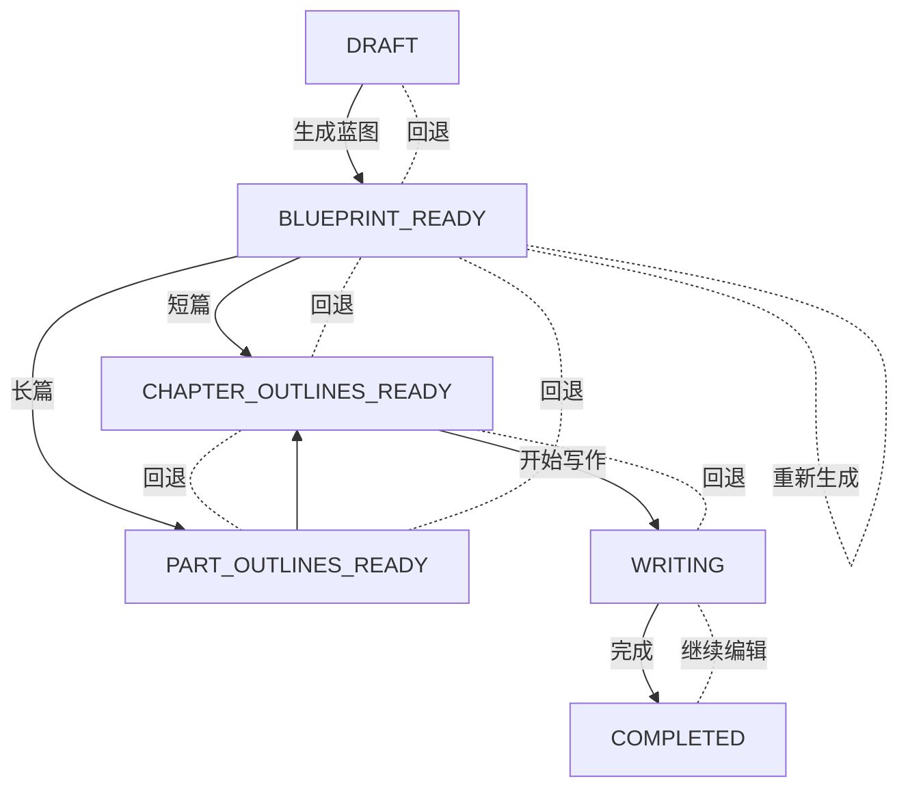

# backend/app/core/state_machine.py - 项目状态机

## 文件概述

统一管理小说项目的状态转换，确保状态流转的一致性和可靠性。采用状态机模式，定义了严格的状态转换规则。

## 核心类

### ProjectStatus 枚举（第12-19行）

```python
class ProjectStatus(str, Enum):
    DRAFT = "draft"
    BLUEPRINT_READY = "blueprint_ready"
    PART_OUTLINES_READY = "part_outlines_ready"
    CHAPTER_OUTLINES_READY = "chapter_outlines_ready"
    WRITING = "writing"
    COMPLETED = "completed"
```

与 `constants.py` 中的定义相同，但此文件专注于状态转换逻辑。

### InvalidStateTransitionError（第22-24行）

```python
class InvalidStateTransitionError(Exception):
    """非法状态转换异常"""
    pass
```

当尝试非法状态转换时抛出此异常。

## ProjectStateMachine 类

### 状态转换规则（第34-60行）

```python
TRANSITIONS: Dict[str, List[str]] = {
    ProjectStatus.DRAFT: [
        ProjectStatus.BLUEPRINT_READY,
    ],
    ProjectStatus.BLUEPRINT_READY: [
        ProjectStatus.PART_OUTLINES_READY,
        ProjectStatus.CHAPTER_OUTLINES_READY,
        ProjectStatus.DRAFT,  # 允许回退
        ProjectStatus.BLUEPRINT_READY,  # 允许重新生成
    ],
    ProjectStatus.PART_OUTLINES_READY: [
        ProjectStatus.CHAPTER_OUTLINES_READY,
        ProjectStatus.BLUEPRINT_READY,
    ],
    ProjectStatus.CHAPTER_OUTLINES_READY: [
        ProjectStatus.WRITING,
        ProjectStatus.PART_OUTLINES_READY,
        ProjectStatus.BLUEPRINT_READY,
    ],
    ProjectStatus.WRITING: [
        ProjectStatus.COMPLETED,
        ProjectStatus.CHAPTER_OUTLINES_READY,
    ],
    ProjectStatus.COMPLETED: [
        ProjectStatus.WRITING,
    ],
}
```

**设计特点：**
- 支持前进：正常工作流推进
- 支持回退：允许修改前期设定
- 支持重新生成：在同一状态重新生成内容

### 状态描述（第63-70行）

```python
STATUS_DESCRIPTIONS: Dict[str, str] = {
    ProjectStatus.DRAFT: "草稿（灵感对话中）",
    ProjectStatus.BLUEPRINT_READY: "蓝图就绪",
    ProjectStatus.PART_OUTLINES_READY: "部分大纲就绪",
    ProjectStatus.CHAPTER_OUTLINES_READY: "章节大纲就绪",
    ProjectStatus.WRITING: "写作中",
    ProjectStatus.COMPLETED: "已完成",
}
```

用于日志记录和错误提示的中文描述。

## 核心方法

### 1. `__init__()`（第72-78行）

```python
def __init__(self, current_status: str):
    """初始化状态机"""
    self.current_status = current_status
```

使用当前项目状态初始化状态机实例。

### 2. `can_transition_to()`（第81-92行）

```python
def can_transition_to(self, new_status: str) -> bool:
    """检查是否可以转换到目标状态"""
    allowed_transitions = self.TRANSITIONS.get(self.current_status, [])
    return new_status in allowed_transitions
```

**功能：** 验证状态转换是否合法

**使用示例：**
```python
state_machine = ProjectStateMachine(project.status)
if state_machine.can_transition_to(ProjectStatus.WRITING):
    # 可以转换
    pass
```

### 3. `transition_to()`（第94-128行）

```python
def transition_to(self, new_status: str, force: bool = False) -> str:
    """执行状态转换"""
```

**参数：**
- `new_status`：目标状态
- `force`：是否强制转换（跳过验证）

**返回：** 新状态字符串

**异常：** `InvalidStateTransitionError` - 非法状态转换

**逻辑流程：**
```python
if not force and not self.can_transition_to(new_status):
    # 非法转换，抛出异常并记录详细信息
    error_msg = f"非法的状态转换: {current} -> {new}. 允许: {allowed}"
    raise InvalidStateTransitionError(error_msg)

logger.info("状态转换: %s -> %s", current, new)
self.current_status = new_status
return new_status
```

**使用示例：**
```python
try:
    state_machine.transition_to(ProjectStatus.WRITING)
except InvalidStateTransitionError as e:
    print(f"状态转换失败: {e}")
```

### 4. `get_allowed_transitions()`（第130-137行）

```python
def get_allowed_transitions(self) -> List[str]:
    """获取当前状态允许转换到的所有状态"""
    return self.TRANSITIONS.get(self.current_status, [])
```

**用途：** 
- UI 显示可用操作
- API 返回可执行动作

**示例：**
```python
allowed = state_machine.get_allowed_transitions()
# ['writing', 'chapter_outlines_ready']
```

### 5. `get_status_description()`（第139-150行）

```python
def get_status_description(self, status: Optional[str] = None) -> str:
    """获取状态描述"""
    target_status = status if status is not None else self.current_status
    return self.STATUS_DESCRIPTIONS.get(target_status, target_status)
```

### 6. `validate_transition()`（第152-165行）

```python
@classmethod
def validate_transition(cls, current_status: str, new_status: str) -> bool:
    """静态方法：验证状态转换是否合法"""
    allowed_transitions = cls.TRANSITIONS.get(current_status, [])
    return new_status in allowed_transitions
```

**用途：** 无需实例化即可验证转换

**示例：**
```python
is_valid = ProjectStateMachine.validate_transition(
    "draft", 
    "blueprint_ready"
)  # True
```

## 状态转换图



## 使用场景

### 1. 服务层状态转换

```python
from backend.app.core.state_machine import ProjectStateMachine

async def transition_project_status(
    project: NovelProject, 
    new_status: str
) -> None:
    """安全地转换项目状态"""
    state_machine = ProjectStateMachine(project.status)
    
    try:
        new_status = state_machine.transition_to(new_status)
        project.status = new_status
        await session.commit()
        logger.info(f"项目 {project.id} 状态转换为 {new_status}")
    except InvalidStateTransitionError as e:
        logger.error(f"状态转换失败: {e}")
        raise HTTPException(status_code=400, detail=str(e))
```

### 2. API 接口验证

```python
@router.post("/{project_id}/blueprint/generate")
async def generate_blueprint(project_id: str):
    project = await get_project(project_id)
    
    # 验证是否可以生成蓝图
    state_machine = ProjectStateMachine(project.status)
    if not state_machine.can_transition_to(ProjectStatus.BLUEPRINT_READY):
        raise HTTPException(
            status_code=400,
            detail=f"当前状态 {project.status} 不允许生成蓝图"
        )
    
    # 执行生成逻辑
    blueprint = await generate_blueprint_logic(project)
    
    # 转换状态
    state_machine.transition_to(ProjectStatus.BLUEPRINT_READY)
    project.status = state_machine.current_status
    await session.commit()
```

### 3. 强制状态转换（管理操作）

```python
# 在特殊情况下强制转换（如数据修复）
state_machine = ProjectStateMachine(project.status)
state_machine.transition_to(
    ProjectStatus.DRAFT, 
    force=True  # 跳过验证
)
```

### 4. UI 状态显示

```python
# 获取当前状态的可用操作
state_machine = ProjectStateMachine(project.status)
allowed = state_machine.get_allowed_transitions()

ui_actions = []
if ProjectStatus.BLUEPRINT_READY in allowed:
    ui_actions.append("生成蓝图")
if ProjectStatus.WRITING in allowed:
    ui_actions.append("开始写作")
```

## 日志输出

状态转换会自动记录日志：

```
INFO: 项目状态转换: 草稿（灵感对话中） -> 蓝图就绪
INFO: 项目状态转换: 蓝图就绪 -> 章节大纲就绪
ERROR: 非法的状态转换: 草稿（灵感对话中） -> 写作中. 
       当前状态只能转换到: 蓝图就绪
```

## 设计原则

### 1. 单一职责
状态机只负责状态转换逻辑，不涉及业务操作。

### 2. 显式转换
所有状态转换必须经过状态机验证，避免直接修改 `project.status`。

### 3. 可回退性
支持回退到前面的状态，便于用户修改设定。

### 4. 可追踪性
所有转换都会记录日志，便于调试和审计。

## 扩展建议

添加新状态时的步骤：

1. **更新枚举：**
```python
class ProjectStatus(str, Enum):
    # ... 现有状态
    REVIEWING = "reviewing"
```

2. **更新转换规则：**
```python
TRANSITIONS = {
    # ... 现有规则
    ProjectStatus.COMPLETED: [
        ProjectStatus.REVIEWING,  # 新增
    ],
    ProjectStatus.REVIEWING: [
        ProjectStatus.COMPLETED,
    ],
}
```

3. **更新描述：**
```python
STATUS_DESCRIPTIONS = {
    # ... 现有描述
    ProjectStatus.REVIEWING: "审核中",
}
```

4. **更新相关业务逻辑**

## 相关文件

- `backend/app/core/constants.py` - 状态枚举定义
- `backend/app/models/novel.py` - NovelProject.status 字段
- `backend/app/services/novel_service.py` - 使用状态机的服务
- `backend/app/api/routers/novels.py` - 状态转换的 API 接口